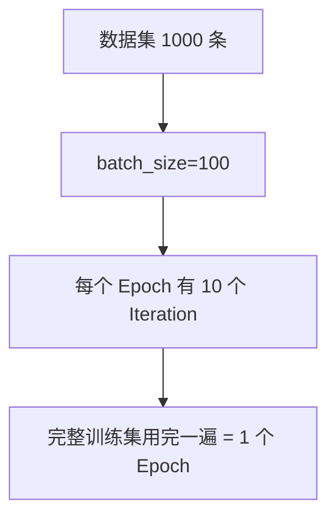

# Batch、Iteration 与 Epoch

三个容易混淆的概念，理解它们的关系有助于设置合理的训练参数。



## 核心要点

* Batch：一次送进模型的数据量，大小由 `batch_size` 决定
* Iteration：执行一次“前向传播 + 反向传播 + 参数更新”
* Epoch：整个训练集被完整使用一遍
* 关系公式：`iterations per epoch = ceil(数据集大小 / batch_size)`
* 例：1000 条数据，batch_size=100，则每个 Epoch 有 10 个 Iteration

## 示例计算

```text
数据集大小：1000
batch_size：100
iterations per epoch = 1000 / 100 = 10

如果数据集大小是 1030，batch_size 仍是 100：
iterations per epoch = ceil(1030 / 100) = 11（最后一个 batch 只有 30 条）
```

---

## 本章测验

### 第 1 题

Epoch 指的是什么？

- A. 一次前向传播加反向传播
- B. 整个训练集被完整使用一遍
- C. 一次送进模型的数据量
- D. 模型的层数

<details>
<summary>选择答案后查看结果</summary>

正确答案：B

答案解析：Epoch 表示模型把整个训练集完整过一遍，通常需要经过多个 Epoch 训练才能收敛。

</details>

### 第 2 题

Iteration 具体对应哪一个操作过程？

- A. 一次数据打乱
- B. 一次前向传播、反向传播和参数更新
- C. 整个数据集处理一遍
- D. 一次模型保存

<details>
<summary>选择答案后查看结果</summary>

正确答案：B

答案解析：每处理完一个 batch 并完成一次“前向传播 → 反向传播 → 参数更新”，就算完成了一次 Iteration。

</details>

### 第 3 题

如果数据集有 1000 条数据，batch_size 是 100，一个 Epoch 会包含多少个 Iteration？

- A. 1 个
- B. 10 个
- C. 100 个
- D. 1000 个

<details>
<summary>选择答案后查看结果</summary>

正确答案：B

答案解析：iterations per epoch = 数据集大小 / batch_size = 1000 / 100 = 10，所以一个 Epoch 里会执行 10 次 Iteration。

</details>

### 第 4 题

如果数据集大小是 1030，batch_size 是 100，最后一个 batch 会有多少条数据？

- A. 100 条
- B. 0 条，会被丢弃
- C. 30 条
- D. 70 条

<details>
<summary>选择答案后查看结果</summary>

正确答案：C

答案解析：1030 除以 100 商 10 余 30，前 10 个 batch 各 100 条，剩下 30 条组成最后一个不满的 batch（除非设置丢弃不完整批次）。

</details>

### 第 5 题

在其他条件不变的情况下，增大 batch_size 会对每个 Epoch 的 Iteration 数量产生什么影响？

- A. Iteration 数量会增多
- B. Iteration 数量会减少
- C. Iteration 数量不受 batch_size 影响
- D. Epoch 的数量会自动增加

<details>
<summary>选择答案后查看结果</summary>

正确答案：B

答案解析：由公式 iterations per epoch = 数据集大小 / batch_size 可知，batch_size 越大，每个 Epoch 需要的 Iteration 次数就越少。

</details>

<!-- QUIZ_DATA_START
{
  "chapter": "11",
  "questions": [
    {"id": 1, "question": "Epoch 指的是什么？", "options": {"A": "一次前向传播加反向传播", "B": "整个训练集被完整使用一遍", "C": "一次送进模型的数据量", "D": "模型的层数"}, "answer": "B", "explanation": "Epoch 表示模型把整个训练集完整过一遍，通常需要经过多个 Epoch 训练才能收敛。"},
    {"id": 2, "question": "Iteration 具体对应哪一个操作过程？", "options": {"A": "一次数据打乱", "B": "一次前向传播、反向传播和参数更新", "C": "整个数据集处理一遍", "D": "一次模型保存"}, "answer": "B", "explanation": "每处理完一个 batch 并完成一次“前向传播 → 反向传播 → 参数更新”，就算完成了一次 Iteration。"},
    {"id": 3, "question": "如果数据集有 1000 条数据，batch_size 是 100，一个 Epoch 会包含多少个 Iteration？", "options": {"A": "1 个", "B": "10 个", "C": "100 个", "D": "1000 个"}, "answer": "B", "explanation": "iterations per epoch = 数据集大小 / batch_size = 1000 / 100 = 10，所以一个 Epoch 里会执行 10 次 Iteration。"},
    {"id": 4, "question": "如果数据集大小是 1030，batch_size 是 100，最后一个 batch 会有多少条数据？", "options": {"A": "100 条", "B": "0 条，会被丢弃", "C": "30 条", "D": "70 条"}, "answer": "C", "explanation": "1030 除以 100 商 10 余 30，前 10 个 batch 各 100 条，剩下 30 条组成最后一个不满的 batch（除非设置丢弃不完整批次）。"},
    {"id": 5, "question": "在其他条件不变的情况下，增大 batch_size 会对每个 Epoch 的 Iteration 数量产生什么影响？", "options": {"A": "Iteration 数量会增多", "B": "Iteration 数量会减少", "C": "Iteration 数量不受 batch_size 影响", "D": "Epoch 的数量会自动增加"}, "answer": "B", "explanation": "由公式 iterations per epoch = 数据集大小 / batch_size 可知，batch_size 越大，每个 Epoch 需要的 Iteration 次数就越少。"}
  ]
}
QUIZ_DATA_END -->
