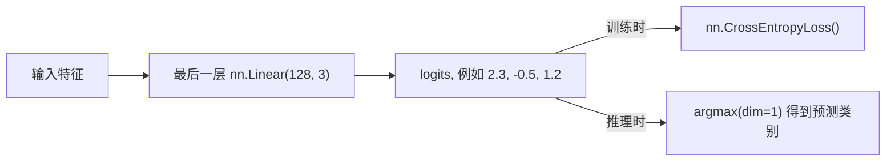

# 多分类模型与 CrossEntropyLoss

处理“猫、狗、鸟”这类多分类任务时，模型输出和损失函数的搭配有严格要求。



## 核心要点

* 多分类模型最后一层输出神经元数量 = 类别数，例如三分类用 `nn.Linear(128, 3)`
* 这些原始输出叫 logits，还没有经过 Softmax
* `nn.CrossEntropyLoss()` 要求：logits 形状 `[batch_size, num_classes]`，targets 形状 `[batch_size]`，targets 类型为 `torch.int64`
* **重要**：使用 CrossEntropyLoss 时，模型最后一层不要手动加 Softmax，因为损失函数内部已经包含了
* 推理时若需要概率，才手动调用 `torch.softmax(logits, dim=1)`；预测类别用 `logits.argmax(dim=1)`

## 代码示例

```python
logits = torch.tensor([
    [2.0, 1.0, 0.1],
    [0.2, 0.4, 2.1],
])
targets = torch.tensor([0, 2])

loss = nn.CrossEntropyLoss()(logits, targets)

# 错误写法：
# probabilities = torch.softmax(logits, dim=1)
# loss = loss_function(probabilities, targets)

# 正确写法：
# loss = loss_function(logits, targets)
```

---

## 本章测验

### 第 1 题

三分类任务的模型最后一层，输出神经元数量应该是多少？

- A. 1
- B. 2
- C. 3
- D. 任意数量都可以

<details>
<summary>选择答案后查看结果</summary>

正确答案：C

答案解析：多分类模型最后一层的输出维度应该等于类别数，三分类任务应设置为 3，对应三个类别各自的 logit。

</details>

### 第 2 题

模型最后一层直接输出的原始数值（如 [2.3, -0.5, 1.2]）通常被称为什么？

- A. probabilities（概率）
- B. logits
- C. gradients（梯度）
- D. targets（标签）

<details>
<summary>选择答案后查看结果</summary>

正确答案：B

答案解析：这些还未经过 Softmax 转换的原始输出叫 logits，CrossEntropyLoss 的输入就是 logits 而不是概率。

</details>

### 第 3 题

使用 `nn.CrossEntropyLoss()` 时，下面哪种写法是正确的？

- A. 先手动做 Softmax，再把概率传给 CrossEntropyLoss
- B. 直接把 logits 传给 CrossEntropyLoss，不手动做 Softmax
- C. 必须先把 logits 转成 one-hot 编码
- D. targets 必须是 float32 类型

<details>
<summary>选择答案后查看结果</summary>

正确答案：B

答案解析：CrossEntropyLoss 内部已经包含了 Softmax 和对数运算，如果训练前手动再做一次 Softmax，会导致计算结果错误，模型难以正常训练。

</details>

### 第 4 题

`nn.CrossEntropyLoss()` 对 targets 的数据类型有什么要求？

- A. 必须是 torch.float32
- B. 必须是 torch.int64
- C. 必须是 torch.bool
- D. 没有类型要求，任意类型都可以

<details>
<summary>选择答案后查看结果</summary>

正确答案：B

答案解析：CrossEntropyLoss 期望 targets 是类别索引，形状为 [batch_size]，数据类型为 torch.int64（即 long 类型）。

</details>

### 第 5 题

推理阶段想要得到模型预测的类别（而不是概率），应该使用下面哪个操作？

- A. `logits.mean(dim=1)`
- B. `logits.argmax(dim=1)`
- C. `logits.sum(dim=1)`
- D. `logits.backward()`

<details>
<summary>选择答案后查看结果</summary>

正确答案：B

答案解析：argmax(dim=1) 会找出每个样本 logits 中数值最大的那个位置索引，对应模型认为最可能的类别；如果需要概率而不是类别，才使用 softmax。

</details>

<!-- QUIZ_DATA_START
{
  "chapter": "12",
  "questions": [
    {"id": 1, "question": "三分类任务的模型最后一层，输出神经元数量应该是多少？", "options": {"A": "1", "B": "2", "C": "3", "D": "任意数量都可以"}, "answer": "C", "explanation": "多分类模型最后一层的输出维度应该等于类别数，三分类任务应设置为 3，对应三个类别各自的 logit。"},
    {"id": 2, "question": "模型最后一层直接输出的原始数值（如 [2.3, -0.5, 1.2]）通常被称为什么？", "options": {"A": "probabilities（概率）", "B": "logits", "C": "gradients（梯度）", "D": "targets（标签）"}, "answer": "B", "explanation": "这些还未经过 Softmax 转换的原始输出叫 logits，CrossEntropyLoss 的输入就是 logits 而不是概率。"},
    {"id": 3, "question": "使用 nn.CrossEntropyLoss() 时，下面哪种写法是正确的？", "options": {"A": "先手动做 Softmax，再把概率传给 CrossEntropyLoss", "B": "直接把 logits 传给 CrossEntropyLoss，不手动做 Softmax", "C": "必须先把 logits 转成 one-hot 编码", "D": "targets 必须是 float32 类型"}, "answer": "B", "explanation": "CrossEntropyLoss 内部已经包含了 Softmax 和对数运算，如果训练前手动再做一次 Softmax，会导致计算结果错误，模型难以正常训练。"},
    {"id": 4, "question": "nn.CrossEntropyLoss() 对 targets 的数据类型有什么要求？", "options": {"A": "必须是 torch.float32", "B": "必须是 torch.int64", "C": "必须是 torch.bool", "D": "没有类型要求，任意类型都可以"}, "answer": "B", "explanation": "CrossEntropyLoss 期望 targets 是类别索引，形状为 [batch_size]，数据类型为 torch.int64（即 long 类型）。"},
    {"id": 5, "question": "推理阶段想要得到模型预测的类别（而不是概率），应该使用下面哪个操作？", "options": {"A": "logits.mean(dim=1)", "B": "logits.argmax(dim=1)", "C": "logits.sum(dim=1)", "D": "logits.backward()"}, "answer": "B", "explanation": "argmax(dim=1) 会找出每个样本 logits 中数值最大的那个位置索引，对应模型认为最可能的类别；如果需要概率而不是类别，才使用 softmax。"}
  ]
}
QUIZ_DATA_END -->
