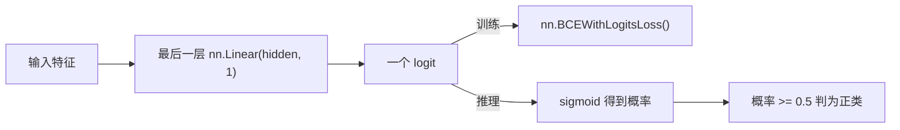

# 二分类模型与 BCEWithLogitsLoss

二分类任务的模型输出、损失函数和推理方式，与多分类有明显不同。



## 核心要点

* 二分类推荐模型输出一个 logit：`nn.Linear(hidden_size, 1)`
* 损失函数用 `nn.BCEWithLogitsLoss()`，内部已经包含 Sigmoid
* 训练时：`logits = model(inputs).squeeze(dim=1)`，`loss = loss_function(logits, targets.float())`
* 推理时：`probabilities = torch.sigmoid(logits)`，`predictions = (probabilities >= 0.5).long()`
* 与 CrossEntropyLoss 类似的重要提醒：训练前不要手动调用 Sigmoid，否则 BCEWithLogitsLoss 会重复计算

## 代码示例

```python
self.output_layer = nn.Linear(hidden_size, 1)

loss_function = nn.BCEWithLogitsLoss()

logits = model(inputs).squeeze(dim=1)
loss = loss_function(logits, targets.float())

probabilities = torch.sigmoid(logits)
predictions = (probabilities >= 0.5).long()
```

---

## 本章测验

### 第 1 题

二分类任务推荐的模型输出层设计是什么？

- A. `nn.Linear(hidden_size, 2)`，输出两个 logit
- B. `nn.Linear(hidden_size, 1)`，输出一个 logit
- C. `nn.Linear(hidden_size, hidden_size)`
- D. 不需要额外的输出层

<details>
<summary>选择答案后查看结果</summary>

正确答案：B

答案解析：文中推荐二分类模型输出一个 logit，即 nn.Linear(hidden_size, 1)，配合 BCEWithLogitsLoss 使用。

</details>

### 第 2 题

二分类任务常用的损失函数是什么？

- A. `nn.MSELoss()`
- B. `nn.CrossEntropyLoss()`
- C. `nn.BCEWithLogitsLoss()`
- D. `nn.L1Loss()`

<details>
<summary>选择答案后查看结果</summary>

正确答案：C

答案解析：二分类任务通常使用 BCEWithLogitsLoss，它内部已经包含 Sigmoid，直接接收模型输出的原始 logit。

</details>

### 第 3 题

使用 `nn.BCEWithLogitsLoss()` 训练时，是否需要在模型输出后手动调用 Sigmoid？

- A. 需要，这样才能得到概率
- B. 不需要，BCEWithLogitsLoss 内部已经包含 Sigmoid
- C. 只有在验证阶段才需要
- D. 只有 batch_size 大于 1 时才需要

<details>
<summary>选择答案后查看结果</summary>

正确答案：B

答案解析：BCEWithLogitsLoss 内部已经融合了 Sigmoid 和二元交叉熵的计算，训练前手动再调用一次 Sigmoid 会导致计算错误。

</details>

### 第 4 题

推理阶段，如何把模型输出的概率转换成最终的 0/1 预测类别？

- A. `probabilities.argmax(dim=1)`
- B. `(probabilities >= 0.5).long()`
- C. `probabilities.backward()`
- D. `probabilities.mean()`

<details>
<summary>选择答案后查看结果</summary>

正确答案：B

答案解析：对二分类问题，通常以 0.5 作为阈值，概率大于等于 0.5 判为正类（1），否则判为负类（0），即 (probabilities >= 0.5).long()。

</details>

### 第 5 题

`targets.float()` 这一步在二分类训练代码中为什么需要？

- A. 因为 BCEWithLogitsLoss 期望 targets 是浮点类型，而不是整数索引
- B. 因为这样可以加快训练速度
- C. 因为模型输出本身就是浮点数，不转换会报维度错误
- D. 这一步不是必须的，可以省略

<details>
<summary>选择答案后查看结果</summary>

正确答案：A

答案解析：与 CrossEntropyLoss 要求整数类别索引不同，BCEWithLogitsLoss 期望 targets 是与 logits 形状匹配的浮点数（0.0 或 1.0），因此需要显式转换成 float。

</details>

<!-- QUIZ_DATA_START
{
  "chapter": "13",
  "questions": [
    {"id": 1, "question": "二分类任务推荐的模型输出层设计是什么？", "options": {"A": "nn.Linear(hidden_size, 2)，输出两个 logit", "B": "nn.Linear(hidden_size, 1)，输出一个 logit", "C": "nn.Linear(hidden_size, hidden_size)", "D": "不需要额外的输出层"}, "answer": "B", "explanation": "文中推荐二分类模型输出一个 logit，即 nn.Linear(hidden_size, 1)，配合 BCEWithLogitsLoss 使用。"},
    {"id": 2, "question": "二分类任务常用的损失函数是什么？", "options": {"A": "nn.MSELoss()", "B": "nn.CrossEntropyLoss()", "C": "nn.BCEWithLogitsLoss()", "D": "nn.L1Loss()"}, "answer": "C", "explanation": "二分类任务通常使用 BCEWithLogitsLoss，它内部已经包含 Sigmoid，直接接收模型输出的原始 logit。"},
    {"id": 3, "question": "使用 nn.BCEWithLogitsLoss() 训练时，是否需要在模型输出后手动调用 Sigmoid？", "options": {"A": "需要，这样才能得到概率", "B": "不需要，BCEWithLogitsLoss 内部已经包含 Sigmoid", "C": "只有在验证阶段才需要", "D": "只有 batch_size 大于 1 时才需要"}, "answer": "B", "explanation": "BCEWithLogitsLoss 内部已经融合了 Sigmoid 和二元交叉熵的计算，训练前手动再调用一次 Sigmoid 会导致计算错误。"},
    {"id": 4, "question": "推理阶段，如何把模型输出的概率转换成最终的 0/1 预测类别？", "options": {"A": "probabilities.argmax(dim=1)", "B": "(probabilities >= 0.5).long()", "C": "probabilities.backward()", "D": "probabilities.mean()"}, "answer": "B", "explanation": "对二分类问题，通常以 0.5 作为阈值，概率大于等于 0.5 判为正类（1），否则判为负类（0），即 (probabilities >= 0.5).long()。"},
    {"id": 5, "question": "targets.float() 这一步在二分类训练代码中为什么需要？", "options": {"A": "因为 BCEWithLogitsLoss 期望 targets 是浮点类型，而不是整数索引", "B": "因为这样可以加快训练速度", "C": "因为模型输出本身就是浮点数，不转换会报维度错误", "D": "这一步不是必须的，可以省略"}, "answer": "A", "explanation": "与 CrossEntropyLoss 要求整数类别索引不同，BCEWithLogitsLoss 期望 targets 是与 logits 形状匹配的浮点数（0.0 或 1.0），因此需要显式转换成 float。"}
  ]
}
QUIZ_DATA_END -->
