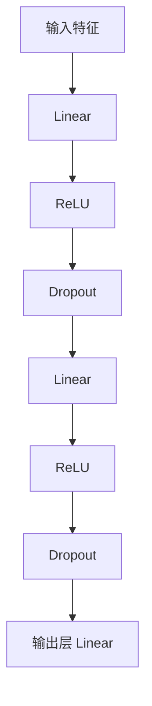

# 多层神经网络与激活函数

没有激活函数，多层线性层叠加仍然等价于一层线性变换。



## 核心要点

* 数学上：`W3(W2(W1x+b1)+b2)+b3` 仍可化简为 `Wx+b`，说明纯线性层堆叠没有意义
* 激活函数为模型引入非线性表达能力，让深层网络能拟合复杂规律
* ReLU：`max(0, x)`，简单、计算快，深层网络常用，但可能出现“死亡 ReLU”
* LeakyReLU：负数区域保留较小梯度，缓解死亡 ReLU 问题
* GELU：Transformer 中非常常见
* Sigmoid：输出 (0,1)，常用于二分类概率输出；Tanh：输出 [-1,1]，部分循环网络仍在使用

## 代码示例

```python
class ClassificationModel(nn.Module):
    def __init__(self, input_size, number_of_classes):
        super().__init__()
        self.network = nn.Sequential(
            nn.Linear(input_size, 256),
            nn.ReLU(),
            nn.Dropout(0.2),
            nn.Linear(256, 128),
            nn.ReLU(),
            nn.Dropout(0.2),
            nn.Linear(128, number_of_classes),
        )

    def forward(self, x):
        return self.network(x)
```

---

## 本章测验

### 第 1 题

如果一个多层网络只有 Linear 层而没有任何激活函数，会发生什么？

- A. 表达能力会比单层线性模型更强
- B. 整个网络在数学上仍然等价于一层线性变换
- C. 模型会自动变成非线性模型
- D. 会导致训练无法进行

<details>
<summary>选择答案后查看结果</summary>

正确答案：B

答案解析：多个线性变换叠加，数学上仍可以化简为形如 Wx+b 的一层线性变换，因此纯 Linear 堆叠不会增加模型的表达能力。

</details>

### 第 2 题

ReLU 激活函数的公式是什么？

- A. `1/(1+e^(-x))`
- B. `max(0, x)`
- C. `x^2`
- D. `(e^x - e^-x)/(e^x + e^-x)`

<details>
<summary>选择答案后查看结果</summary>

正确答案：B

答案解析：ReLU（Rectified Linear Unit）的公式是 max(0, x)，即负数部分被截断为 0，正数部分保持不变。

</details>

### 第 3 题

“死亡 ReLU” 问题指的是什么？

- A. ReLU 层运行速度太慢
- B. 一些神经元的输出长期停留在 0，梯度也变成 0，导致该神经元不再更新
- C. ReLU 会导致模型参数变成负数
- D. ReLU 只能用在最后一层

<details>
<summary>选择答案后查看结果</summary>

正确答案：B

答案解析：当某个神经元的输入长期为负时，ReLU 输出恒为 0，对应梯度也为 0，这个神经元实际上就“死掉”了，不再对训练产生贡献。

</details>

### 第 4 题

LeakyReLU 相比标准 ReLU，主要改进是什么？

- A. 在负数区域保留一个较小的梯度，而不是完全截断为 0
- B. 把所有负数变成正数
- C. 输出范围被限制在 [-1, 1]
- D. 计算速度比 ReLU 更快

<details>
<summary>选择答案后查看结果</summary>

正确答案：A

答案解析：LeakyReLU 在负数区域保留一个较小的斜率（如 0.01），而不是像 ReLU 那样完全变成 0，从而缓解死亡 ReLU 问题。

</details>

### 第 5 题

Sigmoid 激活函数的输出范围是什么？

- A. (0, 1)
- B. [-1, 1]
- C. (-∞, +∞)
- D. [0, +∞)

<details>
<summary>选择答案后查看结果</summary>

正确答案：A

答案解析：Sigmoid 函数 σ(x)=1/(1+e^(-x)) 的输出范围是 (0,1)，因此常用于表示概率，比如二分类任务的输出层。

</details>

<!-- QUIZ_DATA_START
{
  "chapter": "14",
  "questions": [
    {"id": 1, "question": "如果一个多层网络只有 Linear 层而没有任何激活函数，会发生什么？", "options": {"A": "表达能力会比单层线性模型更强", "B": "整个网络在数学上仍然等价于一层线性变换", "C": "模型会自动变成非线性模型", "D": "会导致训练无法进行"}, "answer": "B", "explanation": "多个线性变换叠加，数学上仍可以化简为形如 Wx+b 的一层线性变换，因此纯 Linear 堆叠不会增加模型的表达能力。"},
    {"id": 2, "question": "ReLU 激活函数的公式是什么？", "options": {"A": "1/(1+e^(-x))", "B": "max(0, x)", "C": "x^2", "D": "(e^x - e^-x)/(e^x + e^-x)"}, "answer": "B", "explanation": "ReLU（Rectified Linear Unit）的公式是 max(0, x)，即负数部分被截断为 0，正数部分保持不变。"},
    {"id": 3, "question": "“死亡 ReLU” 问题指的是什么？", "options": {"A": "ReLU 层运行速度太慢", "B": "一些神经元的输出长期停留在 0，梯度也变成 0，导致该神经元不再更新", "C": "ReLU 会导致模型参数变成负数", "D": "ReLU 只能用在最后一层"}, "answer": "B", "explanation": "当某个神经元的输入长期为负时，ReLU 输出恒为 0，对应梯度也为 0，这个神经元实际上就“死掉”了，不再对训练产生贡献。"},
    {"id": 4, "question": "LeakyReLU 相比标准 ReLU，主要改进是什么？", "options": {"A": "在负数区域保留一个较小的梯度，而不是完全截断为 0", "B": "把所有负数变成正数", "C": "输出范围被限制在 [-1, 1]", "D": "计算速度比 ReLU 更快"}, "answer": "A", "explanation": "LeakyReLU 在负数区域保留一个较小的斜率（如 0.01），而不是像 ReLU 那样完全变成 0，从而缓解死亡 ReLU 问题。"},
    {"id": 5, "question": "Sigmoid 激活函数的输出范围是什么？", "options": {"A": "(0, 1)", "B": "[-1, 1]", "C": "(-∞, +∞)", "D": "[0, +∞)"}, "answer": "A", "explanation": "Sigmoid 函数 σ(x)=1/(1+e^(-x)) 的输出范围是 (0,1)，因此常用于表示概率，比如二分类任务的输出层。"}
  ]
}
QUIZ_DATA_END -->
