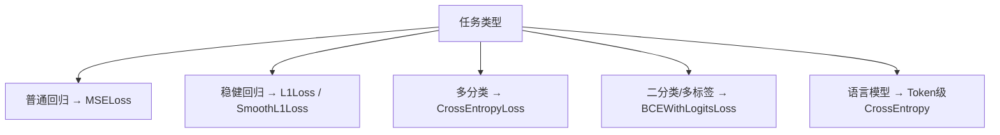

# 损失函数如何选择

不同任务需要匹配不同的损失函数，选错会直接导致训练效果异常。



## 核心要点

| 任务 | 推荐损失函数 |
|---|---|
| 普通回归 | MSELoss |
| 对异常值更稳健的回归 | L1Loss、SmoothL1Loss |
| 多分类 | CrossEntropyLoss |
| 二分类 | BCEWithLogitsLoss |
| 多标签分类 | BCEWithLogitsLoss |
| 语言模型 | Token-level CrossEntropy |

* 损失函数并不等于业务指标：训练常用 CrossEntropy，业务上关心的可能是 Accuracy、F1、Recall
* 损失函数需要连续、几乎处处可导，才适合梯度优化
* 业务指标（如准确率）不一定可导，因此不能直接用作训练目标

## 关键提醒

```text
训练损失：CrossEntropy（用于计算梯度、驱动参数更新）
业务指标：Accuracy、F1、Recall（用于评估最终效果，但不用于反向传播）
```

---

## 本章测验

### 第 1 题

普通回归任务最常用的损失函数是什么？

- A. CrossEntropyLoss
- B. MSELoss
- C. BCEWithLogitsLoss
- D. Dropout

<details>
<summary>选择答案后查看结果</summary>

正确答案：B

答案解析：MSELoss（均方误差）是普通回归任务最常见的损失函数，衡量预测值和真实值差的平方的平均值。

</details>

### 第 2 题

如果回归数据中存在明显异常值，希望损失函数对异常值不那么敏感，应该优先考虑哪个？

- A. CrossEntropyLoss
- B. L1Loss 或 SmoothL1Loss
- C. BCEWithLogitsLoss
- D. Dropout

<details>
<summary>选择答案后查看结果</summary>

正确答案：B

答案解析：L1Loss（绝对误差）对异常值的惩罚比 MSELoss（平方误差）更温和，SmoothL1Loss 结合了两者优点，更适合存在异常值的回归任务。

</details>

### 第 3 题

为什么说“损失函数并不等于业务指标”？

- A. 因为损失函数和业务指标其实是同一个东西，只是名字不同
- B. 因为损失函数需要连续可导以支持梯度优化，而业务指标（如准确率）不一定可导
- C. 因为业务指标不需要用来评估模型
- D. 因为损失函数只能用于分类任务

<details>
<summary>选择答案后查看结果</summary>

正确答案：B

答案解析：梯度优化要求损失函数几乎处处可导，而 Accuracy、F1 等业务指标通常是离散或不可导的，所以训练时用可导的损失函数，评估时再看业务指标。

</details>

### 第 4 题

多标签分类任务（一个样本可能同时属于多个类别）通常使用哪个损失函数？

- A. CrossEntropyLoss
- B. MSELoss
- C. BCEWithLogitsLoss
- D. L1Loss

<details>
<summary>选择答案后查看结果</summary>

正确答案：C

答案解析：多标签分类中每个类别的判断相当于一个独立的二分类问题，因此常用 BCEWithLogitsLoss，对每个标签分别计算二元交叉熵。

</details>

### 第 5 题

语言模型任务通常使用什么级别的损失计算方式？

- A. 整句话只计算一次 MSE
- B. Token 级别的 CrossEntropy
- C. 只在训练结束后统一计算一次
- D. 不需要任何损失函数

<details>
<summary>选择答案后查看结果</summary>

正确答案：B

答案解析：语言模型通常在每个位置（token）上都做一次分类（预测下一个 token），因此使用 token 级别的 CrossEntropy 损失，对所有位置求平均或求和。

</details>

<!-- QUIZ_DATA_START
{
  "chapter": "15",
  "questions": [
    {"id": 1, "question": "普通回归任务最常用的损失函数是什么？", "options": {"A": "CrossEntropyLoss", "B": "MSELoss", "C": "BCEWithLogitsLoss", "D": "Dropout"}, "answer": "B", "explanation": "MSELoss（均方误差）是普通回归任务最常见的损失函数，衡量预测值和真实值差的平方的平均值。"},
    {"id": 2, "question": "如果回归数据中存在明显异常值，希望损失函数对异常值不那么敏感，应该优先考虑哪个？", "options": {"A": "CrossEntropyLoss", "B": "L1Loss 或 SmoothL1Loss", "C": "BCEWithLogitsLoss", "D": "Dropout"}, "answer": "B", "explanation": "L1Loss（绝对误差）对异常值的惩罚比 MSELoss（平方误差）更温和，SmoothL1Loss 结合了两者优点，更适合存在异常值的回归任务。"},
    {"id": 3, "question": "为什么说“损失函数并不等于业务指标”？", "options": {"A": "因为损失函数和业务指标其实是同一个东西，只是名字不同", "B": "因为损失函数需要连续可导以支持梯度优化，而业务指标（如准确率）不一定可导", "C": "因为业务指标不需要用来评估模型", "D": "因为损失函数只能用于分类任务"}, "answer": "B", "explanation": "梯度优化要求损失函数几乎处处可导，而 Accuracy、F1 等业务指标通常是离散或不可导的，所以训练时用可导的损失函数，评估时再看业务指标。"},
    {"id": 4, "question": "多标签分类任务（一个样本可能同时属于多个类别）通常使用哪个损失函数？", "options": {"A": "CrossEntropyLoss", "B": "MSELoss", "C": "BCEWithLogitsLoss", "D": "L1Loss"}, "answer": "C", "explanation": "多标签分类中每个类别的判断相当于一个独立的二分类问题，因此常用 BCEWithLogitsLoss，对每个标签分别计算二元交叉熵。"},
    {"id": 5, "question": "语言模型任务通常使用什么级别的损失计算方式？", "options": {"A": "整句话只计算一次 MSE", "B": "Token 级别的 CrossEntropy", "C": "只在训练结束后统一计算一次", "D": "不需要任何损失函数"}, "answer": "B", "explanation": "语言模型通常在每个位置（token）上都做一次分类（预测下一个 token），因此使用 token 级别的 CrossEntropy 损失，对所有位置求平均或求和。"}
  ]
}
QUIZ_DATA_END -->
