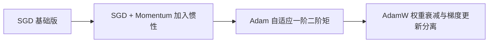

# 优化器：SGD、Momentum、Adam、AdamW

优化器负责根据梯度实际更新模型参数，不同优化器有不同的更新策略。



## 核心要点

* SGD：`θ = θ - η∇θL`，原理简单，泛化有时很好，但对学习率敏感、收敛可能较慢
* SGD + Momentum：增加“惯性”，减少梯度方向频繁摆动，`momentum=0.9` 是常见设置
* Adam：维护梯度的一阶矩和二阶矩估计，为不同参数自适应调整更新幅度，适合快速实验、NLP、Transformer
* AdamW：把权重衰减与梯度更新更清晰地分离，特别适合 Transformer 类模型，是现代项目的常见首选

## 代码示例

```python
torch.optim.SGD(model.parameters(), lr=0.01)
torch.optim.SGD(model.parameters(), lr=0.01, momentum=0.9)
torch.optim.Adam(model.parameters(), lr=1e-3)
torch.optim.AdamW(model.parameters(), lr=3e-4, weight_decay=1e-2)
```

---

## 本章测验

### 第 1 题

SGD 的基本更新公式是什么？

- A. `θ = θ + η∇θL`
- B. `θ = θ - η∇θL`
- C. `θ = θ * η∇θL`
- D. `θ = η / ∇θL`

<details>
<summary>选择答案后查看结果</summary>

正确答案：B

答案解析：SGD 沿着梯度的反方向更新参数，公式是 θ = θ - η∇θL，其中 η 是学习率，负号表示朝损失下降的方向移动。

</details>

### 第 2 题

SGD + Momentum 相比普通 SGD，主要改进是什么？

- A. 完全去掉了学习率的概念
- B. 增加“惯性”，减少梯度方向的频繁摆动
- C. 不再需要计算梯度
- D. 只能用于分类任务

<details>
<summary>选择答案后查看结果</summary>

正确答案：B

答案解析：Momentum 通过引入历史梯度的累积（类似物理中的惯性），使参数更新方向更平滑，减少震荡，加快收敛。

</details>

### 第 3 题

Adam 优化器的核心机制是什么？

- A. 只使用固定学习率，不做任何自适应调整
- B. 维护梯度的一阶矩和二阶矩估计，为不同参数自适应调整更新幅度
- C. 完全依赖人工手动调整每个参数的学习率
- D. 只适用于回归任务

<details>
<summary>选择答案后查看结果</summary>

正确答案：B

答案解析：Adam 会跟踪每个参数梯度的一阶矩（均值）和二阶矩（方差）估计，从而为不同参数自动调整合适的更新步幅，这是它比 SGD 更常用于快速实验的原因之一。

</details>

### 第 4 题

AdamW 相比 Adam，主要改进点是什么？

- A. AdamW 不再使用梯度信息
- B. AdamW 把权重衰减与梯度更新更清晰地分离
- C. AdamW 只能用于图像任务
- D. AdamW 不支持设置学习率

<details>
<summary>选择答案后查看结果</summary>

正确答案：B

答案解析：AdamW 将权重衰减（weight decay）从梯度更新中解耦出来，处理方式更合理，尤其适合 Transformer 类模型，是现代项目常见的默认选择。

</details>

### 第 5 题

下面哪个场景最适合优先尝试 AdamW？

- A. 训练一个现代 Transformer 模型
- B. 只需要跑一个极简的线性回归玩具例子且对速度完全无要求
- C. 完全不需要任何优化器的场景
- D. 只用 CPU 且不关心收敛速度的教学演示

<details>
<summary>选择答案后查看结果</summary>

正确答案：A

答案解析：文中提到现代深度学习项目通常优先尝试 AdamW，尤其适合 Transformer 类模型；其余选项都不是 AdamW 相对更有优势的典型场景。

</details>

<!-- QUIZ_DATA_START
{
  "chapter": "16",
  "questions": [
    {"id": 1, "question": "SGD 的基本更新公式是什么？", "options": {"A": "θ = θ + η∇θL", "B": "θ = θ - η∇θL", "C": "θ = θ * η∇θL", "D": "θ = η / ∇θL"}, "answer": "B", "explanation": "SGD 沿着梯度的反方向更新参数，公式是 θ = θ - η∇θL，其中 η 是学习率，负号表示朝损失下降的方向移动。"},
    {"id": 2, "question": "SGD + Momentum 相比普通 SGD，主要改进是什么？", "options": {"A": "完全去掉了学习率的概念", "B": "增加“惯性”，减少梯度方向的频繁摆动", "C": "不再需要计算梯度", "D": "只能用于分类任务"}, "answer": "B", "explanation": "Momentum 通过引入历史梯度的累积（类似物理中的惯性），使参数更新方向更平滑，减少震荡，加快收敛。"},
    {"id": 3, "question": "Adam 优化器的核心机制是什么？", "options": {"A": "只使用固定学习率，不做任何自适应调整", "B": "维护梯度的一阶矩和二阶矩估计，为不同参数自适应调整更新幅度", "C": "完全依赖人工手动调整每个参数的学习率", "D": "只适用于回归任务"}, "answer": "B", "explanation": "Adam 会跟踪每个参数梯度的一阶矩（均值）和二阶矩（方差）估计，从而为不同参数自动调整合适的更新步幅。"},
    {"id": 4, "question": "AdamW 相比 Adam，主要改进点是什么？", "options": {"A": "AdamW 不再使用梯度信息", "B": "AdamW 把权重衰减与梯度更新更清晰地分离", "C": "AdamW 只能用于图像任务", "D": "AdamW 不支持设置学习率"}, "answer": "B", "explanation": "AdamW 将权重衰减（weight decay）从梯度更新中解耦出来，处理方式更合理，尤其适合 Transformer 类模型。"},
    {"id": 5, "question": "下面哪个场景最适合优先尝试 AdamW？", "options": {"A": "训练一个现代 Transformer 模型", "B": "只需要跑一个极简的线性回归玩具例子且对速度完全无要求", "C": "完全不需要任何优化器的场景", "D": "只用 CPU 且不关心收敛速度的教学演示"}, "answer": "A", "explanation": "文中提到现代深度学习项目通常优先尝试 AdamW，尤其适合 Transformer 类模型。"}
  ]
}
QUIZ_DATA_END -->
