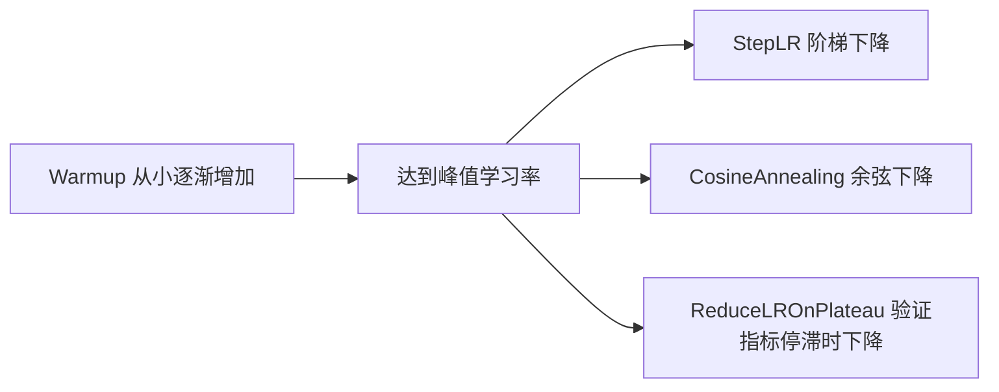

# 学习率与学习率调度器

学习率通常是最重要的超参数，训练中还常常需要让它随时间变化。



## 核心要点

* 学习率太大：Loss 剧烈震荡、不下降、甚至变成 NaN，模型发散
* 学习率太小：训练非常慢，长期停留在较差区域
* 典型初始值：AdamW 常用 1e-3、3e-4、1e-4；SGD 常用 0.1、0.01、0.001；微调预训练模型常用 1e-5～5e-5
* `StepLR`：每隔固定 Epoch 数把学习率乘以一个系数
* `ReduceLROnPlateau`：当验证指标停止改善时降低学习率，需要传入验证损失：`scheduler.step(validation_loss)`
* `CosineAnnealingLR`：学习率按余弦曲线逐渐下降
* Warmup：训练初期先让学习率从较小值逐渐增加，避免参数随机时用过大学习率导致不稳定

## 代码示例

```python
scheduler = torch.optim.lr_scheduler.StepLR(optimizer, step_size=10, gamma=0.1)

for epoch in range(number_of_epochs):
    train_one_epoch(...)
    validate(...)
    scheduler.step()
```

---

## 本章测验

### 第 1 题

学习率设置得过大，最可能出现下面哪种现象？

- A. Loss 平稳下降
- B. Loss 剧烈震荡、不下降，甚至出现 NaN
- C. 模型训练速度变得非常慢但最终仍能收敛
- D. 显存占用会明显减少

<details>
<summary>选择答案后查看结果</summary>

正确答案：B

答案解析：学习率过大会导致参数更新步子太大，越过最优点甚至持续发散，表现为 Loss 剧烈震荡、不下降，严重时数值溢出变成 NaN。

</details>

### 第 2 题

`ReduceLROnPlateau` 调度器主要依据什么来决定是否降低学习率？

- A. 固定的训练轮数
- B. 验证指标是否停止改善
- C. 训练数据的总条数
- D. 模型参数的数量

<details>
<summary>选择答案后查看结果</summary>

正确答案：B

答案解析：ReduceLROnPlateau 会持续监控验证指标（如验证损失），当该指标在设定的耐心轮数内不再改善时，就自动降低学习率。

</details>

### 第 3 题

`CosineAnnealingLR` 调度器让学习率按什么规律变化？

- A. 随机波动
- B. 每隔固定轮数突然翻倍
- C. 按照余弦曲线逐渐下降
- D. 始终保持不变

<details>
<summary>选择答案后查看结果</summary>

正确答案：C

答案解析：CosineAnnealingLR 会让学习率沿着余弦函数的形状平滑地从初始值下降到接近 0，是一种常见的平滑衰减策略。

</details>

### 第 4 题

Warmup 阶段的主要目的是什么？

- A. 让学习率一开始就达到最大值，加快训练
- B. 训练初期让学习率从较小值逐渐增加，避免参数随机时使用过大学习率导致不稳定
- C. 完全跳过前几个 Epoch 的训练
- D. 让模型提前过拟合

<details>
<summary>选择答案后查看结果</summary>

正确答案：B

答案解析：训练刚开始时模型参数是随机的，如果立刻使用较大学习率容易导致训练不稳定，因此常见做法是先用 Warmup 让学习率从小值逐步爬升到峰值。

</details>

### 第 5 题

微调一个预训练模型时，文中给出的典型学习率范围大致是多少？

- A. 1~10
- B. 0.1~1
- C. 1e-5～5e-5
- D. 1e-1

<details>
<summary>选择答案后查看结果</summary>

正确答案：C

答案解析：文中提到微调预训练模型的典型初始学习率大约在 1e-5 到 5e-5 之间，比从零开始训练时常用的学习率要小很多，因为预训练参数已经比较接近合理值。

</details>

<!-- QUIZ_DATA_START
{
  "chapter": "17",
  "questions": [
    {"id": 1, "question": "学习率设置得过大，最可能出现下面哪种现象？", "options": {"A": "Loss 平稳下降", "B": "Loss 剧烈震荡、不下降，甚至出现 NaN", "C": "模型训练速度变得非常慢但最终仍能收敛", "D": "显存占用会明显减少"}, "answer": "B", "explanation": "学习率过大会导致参数更新步子太大，越过最优点甚至持续发散，表现为 Loss 剧烈震荡、不下降，严重时数值溢出变成 NaN。"},
    {"id": 2, "question": "ReduceLROnPlateau 调度器主要依据什么来决定是否降低学习率？", "options": {"A": "固定的训练轮数", "B": "验证指标是否停止改善", "C": "训练数据的总条数", "D": "模型参数的数量"}, "answer": "B", "explanation": "ReduceLROnPlateau 会持续监控验证指标（如验证损失），当该指标在设定的耐心轮数内不再改善时，就自动降低学习率。"},
    {"id": 3, "question": "CosineAnnealingLR 调度器让学习率按什么规律变化？", "options": {"A": "随机波动", "B": "每隔固定轮数突然翻倍", "C": "按照余弦曲线逐渐下降", "D": "始终保持不变"}, "answer": "C", "explanation": "CosineAnnealingLR 会让学习率沿着余弦函数的形状平滑地从初始值下降到接近 0，是一种常见的平滑衰减策略。"},
    {"id": 4, "question": "Warmup 阶段的主要目的是什么？", "options": {"A": "让学习率一开始就达到最大值，加快训练", "B": "训练初期让学习率从较小值逐渐增加，避免参数随机时使用过大学习率导致不稳定", "C": "完全跳过前几个 Epoch 的训练", "D": "让模型提前过拟合"}, "answer": "B", "explanation": "训练刚开始时模型参数是随机的，如果立刻使用较大学习率容易导致训练不稳定，因此常见做法是先用 Warmup 让学习率从小值逐步爬升到峰值。"},
    {"id": 5, "question": "微调一个预训练模型时，文中给出的典型学习率范围大致是多少？", "options": {"A": "1~10", "B": "0.1~1", "C": "1e-5～5e-5", "D": "1e-1"}, "answer": "C", "explanation": "文中提到微调预训练模型的典型初始学习率大约在 1e-5 到 5e-5 之间，比从零开始训练时常用的学习率要小很多。"}
  ]
}
QUIZ_DATA_END -->
