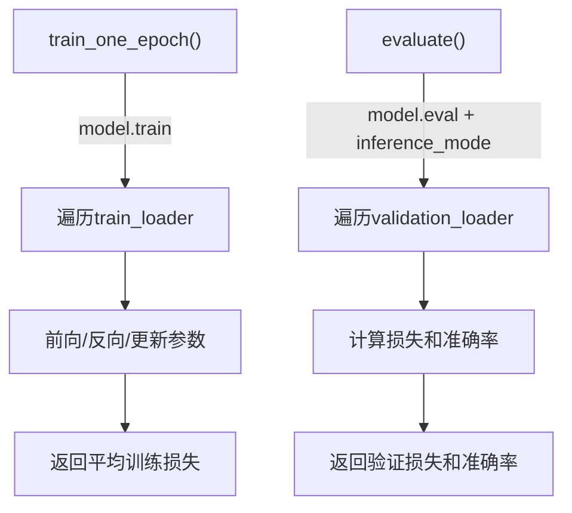

# 规范的训练与验证函数

把训练和验证逻辑分别封装成独立函数，是专业项目的标准做法。



## 核心要点

* `train_one_epoch`：调用 `model.train()`，遍历训练数据，执行标准五步训练循环，返回该 Epoch 的平均损失
* `evaluate`：用 `@torch.inference_mode()` 装饰，调用 `model.eval()`，只做前向传播不做反向传播
* 累加损失时用 `loss.item() * batch_size`，最后除以样本总数得到平均损失，而不是简单地把 batch 的 loss 相加
* 用 `predictions == targets` 统计正确样本数，除以总样本数得到准确率
* 主循环里通常会比较当前验证损失与历史最优，若更优则保存模型：`torch.save(model.state_dict(), "best_model.pt")`

## 代码要点

```python
def train_one_epoch(model, data_loader, loss_function, optimizer, device):
    model.train()
    total_loss, total_samples = 0.0, 0
    for inputs, targets in data_loader:
        inputs, targets = inputs.to(device), targets.to(device)
        optimizer.zero_grad(set_to_none=True)
        logits = model(inputs)
        loss = loss_function(logits, targets)
        loss.backward()
        optimizer.step()
        total_loss += loss.item() * inputs.size(0)
        total_samples += inputs.size(0)
    return total_loss / total_samples


@torch.inference_mode()
def evaluate(model, data_loader, loss_function, device):
    model.eval()
    ...
```

---

## 本章测验

### 第 1 题

在 `train_one_epoch` 函数的最开始，为什么要调用 `model.train()`？

- A. 这样可以让训练速度更快
- B. 让 Dropout、BatchNorm 等模块切换到训练模式的行为
- C. 这一步会自动清空所有梯度
- D. 这一步是可选的，写不写都一样

<details>
<summary>选择答案后查看结果</summary>

正确答案：B

答案解析：model.train() 会让 Dropout、BatchNorm 等对训练/推理行为不同的模块切换到训练模式，比如 Dropout 会真正随机丢弃部分激活值。

</details>

### 第 2 题

`evaluate` 函数为什么要用 `@torch.inference_mode()` 装饰，并调用 `model.eval()`？

- A. 只是为了让代码看起来更专业，没有实际作用
- B. 避免构建计算图节省资源，同时让 Dropout、BatchNorm 等切换到推理行为
- C. 这样可以让验证集自动变成训练集
- D. 这样可以跳过损失计算

<details>
<summary>选择答案后查看结果</summary>

正确答案：B

答案解析：inference_mode 避免构建反向传播所需的计算图，节省内存和计算；model.eval() 则让 Dropout 停止随机丢弃、BatchNorm 使用训练时累积的统计量，两者共同保证验证阶段行为正确。

</details>

### 第 3 题

为什么要用 `loss.item() * inputs.size(0)` 累加损失，而不是直接把每个 batch 的 loss 加起来？

- A. 因为 loss.item() 得到的是这个 batch 的平均损失，乘以样本数才能还原成总损失，方便最后统一除以总样本数得到整体平均
- B. 因为直接相加会导致程序报错
- C. 因为这样可以让训练速度更快
- D. 这两种写法完全等价，没有区别

<details>
<summary>选择答案后查看结果</summary>

正确答案：A

答案解析：loss_function 默认返回的是当前 batch 的平均损失，如果各 batch 大小不完全相同，直接把 loss 相加再除以 batch 数量会不准确，因此要先乘以样本数还原为总损失，最后统一除以总样本数。

</details>

### 第 4 题

代码中为什么用 `loss.item()` 而不是直接使用 `loss` 进行累加？

- A. `loss.item()` 会自动完成反向传播
- B. `loss.item()` 得到一个普通 Python 数值，可以安全累加，不会把整个计算图保留在内存里
- C. 两者性能完全一样，没有任何区别
- D. `loss` 本身无法参与任何数学运算

<details>
<summary>选择答案后查看结果</summary>

正确答案：B

答案解析：如果直接用 `total_loss += loss`，会把带有 Autograd 历史的 Tensor 保留下来，可能导致计算图被意外保留、内存持续增长；用 loss.item() 取出普通数值就没有这个问题。

</details>

### 第 5 题

主训练循环中，为什么通常要比较当前验证损失和历史最优验证损失，并据此保存模型？

- A. 为了让代码运行得更快
- B. 为了保留在验证集上表现最好的一版模型参数，而不是训练结束时的最后一版
- C. 这样可以避免使用测试集
- D. 这一步和模型效果完全无关，只是习惯性写法

<details>
<summary>选择答案后查看结果</summary>

正确答案：B

答案解析：训练后期模型可能已经开始过拟合，验证损失不再是最优，因此通常会持续跟踪历史最优验证损失，只在出现更优结果时保存模型，确保最终拿到的是泛化能力最好的一版。

</details>

<!-- QUIZ_DATA_START
{
  "chapter": "18",
  "questions": [
    {"id": 1, "question": "在 train_one_epoch 函数的最开始，为什么要调用 model.train()？", "options": {"A": "这样可以让训练速度更快", "B": "让 Dropout、BatchNorm 等模块切换到训练模式的行为", "C": "这一步会自动清空所有梯度", "D": "这一步是可选的，写不写都一样"}, "answer": "B", "explanation": "model.train() 会让 Dropout、BatchNorm 等对训练/推理行为不同的模块切换到训练模式，比如 Dropout 会真正随机丢弃部分激活值。"},
    {"id": 2, "question": "evaluate 函数为什么要用 @torch.inference_mode() 装饰，并调用 model.eval()？", "options": {"A": "只是为了让代码看起来更专业，没有实际作用", "B": "避免构建计算图节省资源，同时让 Dropout、BatchNorm 等切换到推理行为", "C": "这样可以让验证集自动变成训练集", "D": "这样可以跳过损失计算"}, "answer": "B", "explanation": "inference_mode 避免构建反向传播所需的计算图，节省内存和计算；model.eval() 则让 Dropout 停止随机丢弃、BatchNorm 使用训练时累积的统计量。"},
    {"id": 3, "question": "为什么要用 loss.item() * inputs.size(0) 累加损失，而不是直接把每个 batch 的 loss 加起来？", "options": {"A": "因为 loss.item() 得到的是这个 batch 的平均损失，乘以样本数才能还原成总损失，方便最后统一除以总样本数得到整体平均", "B": "因为直接相加会导致程序报错", "C": "因为这样可以让训练速度更快", "D": "这两种写法完全等价，没有区别"}, "answer": "A", "explanation": "loss_function 默认返回的是当前 batch 的平均损失，直接相加再除以 batch 数量在 batch 大小不一致时会不准确，因此要先还原为总损失。"},
    {"id": 4, "question": "代码中为什么用 loss.item() 而不是直接使用 loss 进行累加？", "options": {"A": "loss.item() 会自动完成反向传播", "B": "loss.item() 得到一个普通 Python 数值，可以安全累加，不会把整个计算图保留在内存里", "C": "两者性能完全一样，没有任何区别", "D": "loss 本身无法参与任何数学运算"}, "answer": "B", "explanation": "如果直接用 total_loss += loss，会把带有 Autograd 历史的 Tensor 保留下来，可能导致计算图被意外保留、内存持续增长。"},
    {"id": 5, "question": "主训练循环中，为什么通常要比较当前验证损失和历史最优验证损失，并据此保存模型？", "options": {"A": "为了让代码运行得更快", "B": "为了保留在验证集上表现最好的一版模型参数，而不是训练结束时的最后一版", "C": "这样可以避免使用测试集", "D": "这一步和模型效果完全无关，只是习惯性写法"}, "answer": "B", "explanation": "训练后期模型可能已经开始过拟合，验证损失不再是最优，因此通常会持续跟踪历史最优验证损失，只在出现更优结果时保存模型。"}
  ]
}
QUIZ_DATA_END -->
