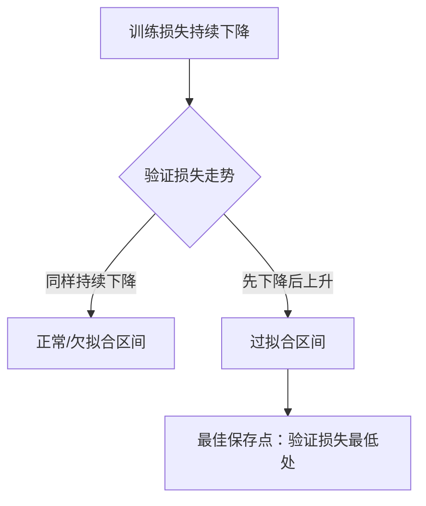

# 过拟合与欠拟合

理解训练曲线，是判断模型该往哪个方向调整的关键技能。



## 核心要点

* 欠拟合表现：训练集效果差，验证集效果也差
  * 可能原因：模型太简单、训练时间太短、学习率不合适、特征不足、正则化太强
  * 解决：增加模型容量、延长训练、改善特征、调整学习率、减弱正则化
* 过拟合表现：训练集越来越好，验证集开始变差
  * 解决：增加训练数据、数据增强、Dropout、Weight Decay、Early Stopping、缩小模型、迁移学习
* 典型曲线：训练损失一直下降，验证损失先降后升，最佳保存点在验证损失最低处

## 判断思路

```text
训练集差 + 验证集差   → 欠拟合
训练集好 + 验证集差   → 过拟合
训练集好 + 验证集也好 → 拟合良好
```

---

## 本章测验

### 第 1 题

欠拟合的典型表现是什么？

- A. 训练集效果很好，验证集效果差
- B. 训练集效果差，验证集效果也差
- C. 训练集和验证集效果都很好
- D. 只有测试集效果差

<details>
<summary>选择答案后查看结果</summary>

正确答案：B

答案解析：欠拟合意味着模型连训练数据本身都没有学好，因此训练集和验证集的表现通常都比较差。

</details>

### 第 2 题

过拟合的典型表现是什么？

- A. 训练损失和验证损失都持续下降
- B. 训练损失持续下降，验证损失先下降后上升
- C. 训练损失和验证损失都不下降
- D. 训练损失上升，验证损失下降

<details>
<summary>选择答案后查看结果</summary>

正确答案：B

答案解析：过拟合时模型在训练集上表现越来越好（训练损失持续下降），但在没见过的验证集上开始变差，验证损失呈现先降后升的曲线。

</details>

### 第 3 题

如果模型出现欠拟合，下面哪种做法比较合理？

- A. 增大 Dropout 比例
- B. 增加模型容量或延长训练时间
- C. 减少训练数据
- D. 提前触发 Early Stopping

<details>
<summary>选择答案后查看结果</summary>

正确答案：B

答案解析：欠拟合说明模型能力或训练不够充分，应该增加模型容量、延长训练、改善特征或调整学习率，而不是像应对过拟合那样加正则化。

</details>

### 第 4 题

如果模型出现过拟合，下面哪种做法比较合理？

- A. 增加模型层数和参数量
- B. 增加训练数据、使用 Dropout、Weight Decay 或 Early Stopping
- C. 减少正则化强度
- D. 延长训练时间到更多 Epoch

<details>
<summary>选择答案后查看结果</summary>

正确答案：B

答案解析：过拟合是模型过度记住了训练数据的细节，应对策略是增加数据多样性、加强正则化（Dropout、Weight Decay）或用 Early Stopping 及时停止训练。

</details>

### 第 5 题

在典型的“训练损失持续下降、验证损失先降后升”曲线中，最佳的模型保存点应该在哪里？

- A. 训练刚开始时
- B. 验证损失最低的那个点
- C. 训练损失最低的那个点
- D. 训练结束的最后一个 Epoch

<details>
<summary>选择答案后查看结果</summary>

正确答案：B

答案解析：验证损失最低点代表模型在未见数据上表现最好的时刻，之后继续训练模型会逐渐过拟合，因此这个点是最佳的模型保存点。

</details>

<!-- QUIZ_DATA_START
{
  "chapter": "19",
  "questions": [
    {"id": 1, "question": "欠拟合的典型表现是什么？", "options": {"A": "训练集效果很好，验证集效果差", "B": "训练集效果差，验证集效果也差", "C": "训练集和验证集效果都很好", "D": "只有测试集效果差"}, "answer": "B", "explanation": "欠拟合意味着模型连训练数据本身都没有学好，因此训练集和验证集的表现通常都比较差。"},
    {"id": 2, "question": "过拟合的典型表现是什么？", "options": {"A": "训练损失和验证损失都持续下降", "B": "训练损失持续下降，验证损失先下降后上升", "C": "训练损失和验证损失都不下降", "D": "训练损失上升，验证损失下降"}, "answer": "B", "explanation": "过拟合时模型在训练集上表现越来越好，但在验证集上开始变差，验证损失呈现先降后升的曲线。"},
    {"id": 3, "question": "如果模型出现欠拟合，下面哪种做法比较合理？", "options": {"A": "增大 Dropout 比例", "B": "增加模型容量或延长训练时间", "C": "减少训练数据", "D": "提前触发 Early Stopping"}, "answer": "B", "explanation": "欠拟合说明模型能力或训练不够充分，应该增加模型容量、延长训练、改善特征或调整学习率。"},
    {"id": 4, "question": "如果模型出现过拟合，下面哪种做法比较合理？", "options": {"A": "增加模型层数和参数量", "B": "增加训练数据、使用 Dropout、Weight Decay 或 Early Stopping", "C": "减少正则化强度", "D": "延长训练时间到更多 Epoch"}, "answer": "B", "explanation": "过拟合是模型过度记住了训练数据的细节，应对策略是增加数据多样性、加强正则化或用 Early Stopping 及时停止训练。"},
    {"id": 5, "question": "在典型的“训练损失持续下降、验证损失先降后升”曲线中，最佳的模型保存点应该在哪里？", "options": {"A": "训练刚开始时", "B": "验证损失最低的那个点", "C": "训练损失最低的那个点", "D": "训练结束的最后一个 Epoch"}, "answer": "B", "explanation": "验证损失最低点代表模型在未见数据上表现最好的时刻，之后继续训练模型会逐渐过拟合。"}
  ]
}
QUIZ_DATA_END -->
