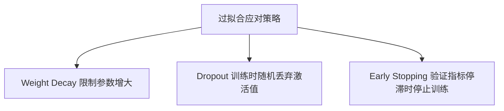

# 正则化：Weight Decay、Dropout、Early Stopping

正则化是应对过拟合最常用的一组技术手段。



## 核心要点

* Weight Decay：在优化器中设置，如 `AdamW(..., weight_decay=1e-2)`，目标是限制参数无限增大
* Dropout：`nn.Dropout(p=0.2)`，训练时随机将部分激活值置零，推理时使用完整网络；常见范围 0.1～0.5，不宜设置过大
* Early Stopping：连续若干轮验证损失没有改善（达到 patience 次数）就提前停止训练，并只保留验证损失最优的那次模型

## 代码示例

```python
patience = 5
waiting = 0
best_loss = float("inf")

for epoch in range(100):
    train_loss = train_one_epoch(...)
    validation_loss, _ = evaluate(...)

    if validation_loss < best_loss:
        best_loss = validation_loss
        waiting = 0
        torch.save(model.state_dict(), "best_model.pt")
    else:
        waiting += 1

    if waiting >= patience:
        print("Early stopping")
        break
```

---

## 本章测验

### 第 1 题

Weight Decay 的主要目标是什么？

- A. 加快前向传播速度
- B. 限制模型参数无限增大
- C. 自动调整 batch_size
- D. 增加模型的层数

<details>
<summary>选择答案后查看结果</summary>

正确答案：B

答案解析：Weight Decay 通过在损失或更新过程中对参数大小加以惩罚，限制参数无限增大，从而减少模型过度拟合训练数据细节的风险。

</details>

### 第 2 题

Dropout 的常见取值范围大致是多少？

- A. 0.0001～0.001
- B. 0.1～0.5
- C. 1～5
- D. 100～500

<details>
<summary>选择答案后查看结果</summary>

正确答案：B

答案解析：文中提到 Dropout 的常见范围是 0.1～0.5，设置得太大（比如接近 1）会让网络丢弃过多信息，反而影响训练效果。

</details>

### 第 3 题

Dropout 在训练阶段和推理阶段的行为有什么不同？

- A. 训练和推理阶段行为完全相同
- B. 训练时随机丢弃部分激活值，推理时使用完整网络
- C. 推理时才随机丢弃部分激活值
- D. Dropout 只在验证阶段生效

<details>
<summary>选择答案后查看结果</summary>

正确答案：B

答案解析：Dropout 只在训练阶段（model.train() 状态下）随机将部分激活值置零，起到正则化效果；推理阶段（model.eval() 状态下）会使用完整的网络，不再丢弃。

</details>

### 第 4 题

在 Early Stopping 的代码逻辑中，`patience` 参数的含义是什么？

- A. 训练总共要跑多少个 Epoch
- B. 验证损失连续多少轮没有改善后，就提前停止训练
- C. 学习率每隔多少轮下降一次
- D. Dropout 的丢弃比例

<details>
<summary>选择答案后查看结果</summary>

正确答案：B

答案解析：patience 表示允许验证损失连续多少轮没有改善的“容忍轮数”，一旦超过这个次数仍未出现更优结果，就触发提前停止。

</details>

### 第 5 题

在 Early Stopping 的代码中，为什么只有当 `validation_loss < best_loss` 时才保存模型？

- A. 这样可以节省训练时间
- B. 确保最终保留的是验证集上表现最好的一版模型参数
- C. 这样可以自动调整学习率
- D. 这一步和模型效果无关，只是编码习惯

<details>
<summary>选择答案后查看结果</summary>

正确答案：B

答案解析：只在验证损失创新低时才保存模型，可以确保最终得到的 checkpoint 始终是历史上验证表现最好的那一版，而不是训练最后阶段可能已经过拟合的版本。

</details>

<!-- QUIZ_DATA_START
{
  "chapter": "20",
  "questions": [
    {"id": 1, "question": "Weight Decay 的主要目标是什么？", "options": {"A": "加快前向传播速度", "B": "限制模型参数无限增大", "C": "自动调整 batch_size", "D": "增加模型的层数"}, "answer": "B", "explanation": "Weight Decay 通过在损失或更新过程中对参数大小加以惩罚，限制参数无限增大，从而减少模型过度拟合训练数据细节的风险。"},
    {"id": 2, "question": "Dropout 的常见取值范围大致是多少？", "options": {"A": "0.0001～0.001", "B": "0.1～0.5", "C": "1～5", "D": "100～500"}, "answer": "B", "explanation": "文中提到 Dropout 的常见范围是 0.1～0.5，设置得太大会让网络丢弃过多信息，反而影响训练效果。"},
    {"id": 3, "question": "Dropout 在训练阶段和推理阶段的行为有什么不同？", "options": {"A": "训练和推理阶段行为完全相同", "B": "训练时随机丢弃部分激活值，推理时使用完整网络", "C": "推理时才随机丢弃部分激活值", "D": "Dropout 只在验证阶段生效"}, "answer": "B", "explanation": "Dropout 只在训练阶段随机将部分激活值置零，起到正则化效果；推理阶段会使用完整的网络，不再丢弃。"},
    {"id": 4, "question": "在 Early Stopping 的代码逻辑中，patience 参数的含义是什么？", "options": {"A": "训练总共要跑多少个 Epoch", "B": "验证损失连续多少轮没有改善后，就提前停止训练", "C": "学习率每隔多少轮下降一次", "D": "Dropout 的丢弃比例"}, "answer": "B", "explanation": "patience 表示允许验证损失连续多少轮没有改善的“容忍轮数”，一旦超过这个次数仍未出现更优结果，就触发提前停止。"},
    {"id": 5, "question": "在 Early Stopping 的代码中，为什么只有当 validation_loss < best_loss 时才保存模型？", "options": {"A": "这样可以节省训练时间", "B": "确保最终保留的是验证集上表现最好的一版模型参数", "C": "这样可以自动调整学习率", "D": "这一步和模型效果无关，只是编码习惯"}, "answer": "B", "explanation": "只在验证损失创新低时才保存模型，可以确保最终得到的 checkpoint 始终是历史上验证表现最好的那一版。"}
  ]
}
QUIZ_DATA_END -->
