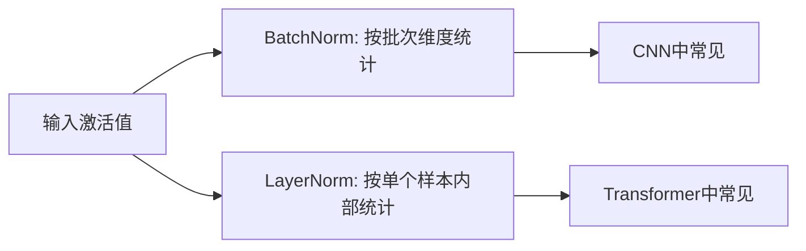

# Batch Normalization 与 Layer Normalization

归一化层能让训练更稳定，但 BatchNorm 和 LayerNorm 的统计维度不同。



## 核心要点

* `nn.BatchNorm1d` / `nn.BatchNorm2d`：依赖批次统计信息（同一 batch 内所有样本的均值方差），CNN 中常见
* BatchNorm 的问题：batch 很小时统计量可能不稳定，且训练和推理阶段行为不同（推理用累积的移动平均统计量）
* `nn.LayerNorm`：在每个样本内部进行归一化，不依赖 batch 内其他样本
* 粗略记忆：CNN 常用 BatchNorm，Transformer 常用 LayerNorm

## 代码示例

```python
nn.BatchNorm1d(hidden_size)
nn.BatchNorm2d(number_of_channels)

nn.LayerNorm(hidden_size)
```

---

## 本章测验

### 第 1 题

BatchNorm 的统计信息是基于什么范围计算的？

- A. 同一个样本内部所有特征
- B. 同一个 batch 内所有样本
- C. 整个训练集
- D. 单个像素点

<details>
<summary>选择答案后查看结果</summary>

正确答案：B

答案解析：BatchNorm 依赖同一批次（batch）内所有样本的均值和方差进行归一化，这也是它名字中 “Batch” 的由来。

</details>

### 第 2 题

BatchNorm 在 batch 很小的情况下容易出现什么问题？

- A. 计算速度会变得更快
- B. 统计量（均值、方差）可能不稳定，影响训练效果
- C. 会自动增大学习率
- D. 完全不受 batch 大小影响

<details>
<summary>选择答案后查看结果</summary>

正确答案：B

答案解析：当 batch 很小时，用少量样本估计出的均值和方差波动较大，可能不能准确反映整体数据分布，从而影响训练稳定性。

</details>

### 第 3 题

LayerNorm 的归一化范围是什么？

- A. 整个训练集
- B. 同一个 batch 内所有样本
- C. 每个样本内部自己的特征维度
- D. 只对模型的第一层生效

<details>
<summary>选择答案后查看结果</summary>

正确答案：C

答案解析：LayerNorm 在每个样本内部进行归一化，不依赖 batch 内其他样本的统计量，因此不会受 batch 大小影响。

</details>

### 第 4 题

下面哪一种粗略的对应关系符合文中的说法？

- A. CNN 常用 LayerNorm，Transformer 常用 BatchNorm
- B. CNN 常用 BatchNorm，Transformer 常用 LayerNorm
- C. CNN 和 Transformer 都只能用 BatchNorm
- D. CNN 和 Transformer 都不使用任何归一化层

<details>
<summary>选择答案后查看结果</summary>

正确答案：B

答案解析：文中给出的粗略记忆是 CNN 中 BatchNorm 常见，Transformer 中通常使用 LayerNorm，这是两类结构常见的搭配习惯。

</details>

### 第 5 题

BatchNorm 在训练阶段和推理阶段的行为差异主要体现在哪里？

- A. 训练和推理阶段完全没有差异
- B. 推理阶段会使用训练时累积得到的统计量，而不是当前批次的统计量
- C. 推理阶段会随机丢弃部分神经元
- D. 推理阶段不再需要输入数据

<details>
<summary>选择答案后查看结果</summary>

正确答案：B

答案解析：BatchNorm 在训练时使用当前 batch 的统计量，同时累积一个移动平均；推理时通常使用训练过程中累积下来的移动平均统计量，而不是当前推理 batch 的统计量。

</details>

<!-- QUIZ_DATA_START
{
  "chapter": "21",
  "questions": [
    {"id": 1, "question": "BatchNorm 的统计信息是基于什么范围计算的？", "options": {"A": "同一个样本内部所有特征", "B": "同一个 batch 内所有样本", "C": "整个训练集", "D": "单个像素点"}, "answer": "B", "explanation": "BatchNorm 依赖同一批次（batch）内所有样本的均值和方差进行归一化，这也是它名字中“Batch”的由来。"},
    {"id": 2, "question": "BatchNorm 在 batch 很小的情况下容易出现什么问题？", "options": {"A": "计算速度会变得更快", "B": "统计量（均值、方差）可能不稳定，影响训练效果", "C": "会自动增大学习率", "D": "完全不受 batch 大小影响"}, "answer": "B", "explanation": "当 batch 很小时，用少量样本估计出的均值和方差波动较大，可能不能准确反映整体数据分布。"},
    {"id": 3, "question": "LayerNorm 的归一化范围是什么？", "options": {"A": "整个训练集", "B": "同一个 batch 内所有样本", "C": "每个样本内部自己的特征维度", "D": "只对模型的第一层生效"}, "answer": "C", "explanation": "LayerNorm 在每个样本内部进行归一化，不依赖 batch 内其他样本的统计量，因此不会受 batch 大小影响。"},
    {"id": 4, "question": "下面哪一种粗略的对应关系符合文中的说法？", "options": {"A": "CNN 常用 LayerNorm，Transformer 常用 BatchNorm", "B": "CNN 常用 BatchNorm，Transformer 常用 LayerNorm", "C": "CNN 和 Transformer 都只能用 BatchNorm", "D": "CNN 和 Transformer 都不使用任何归一化层"}, "answer": "B", "explanation": "文中给出的粗略记忆是 CNN 中 BatchNorm 常见，Transformer 中通常使用 LayerNorm。"},
    {"id": 5, "question": "BatchNorm 在训练阶段和推理阶段的行为差异主要体现在哪里？", "options": {"A": "训练和推理阶段完全没有差异", "B": "推理阶段会使用训练时累积得到的统计量，而不是当前批次的统计量", "C": "推理阶段会随机丢弃部分神经元", "D": "推理阶段不再需要输入数据"}, "answer": "B", "explanation": "BatchNorm 在训练时使用当前 batch 的统计量，同时累积一个移动平均；推理时通常使用训练过程中累积下来的移动平均统计量。"}
  ]
}
QUIZ_DATA_END -->
