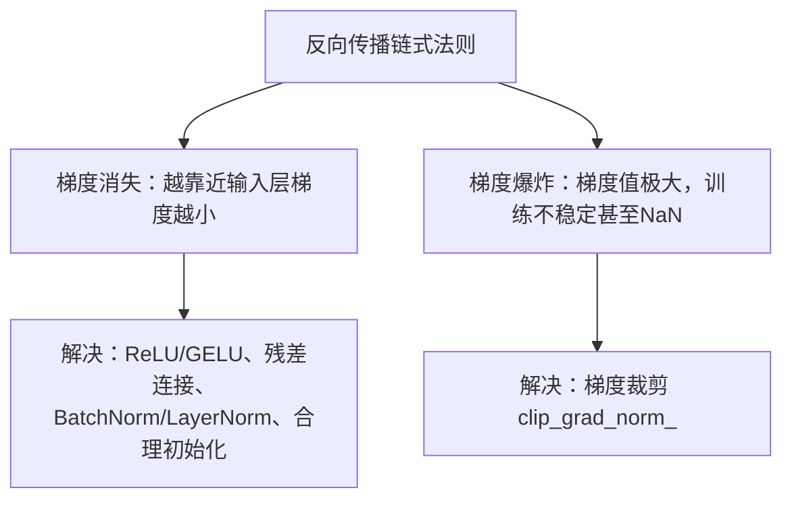

# 梯度消失与梯度爆炸

深层网络训练中最经典的两类数值问题。



## 核心要点

* 梯度消失：越靠近输入层，梯度越小，参数几乎不更新；常见原因是网络很深、Sigmoid/Tanh 饱和、初始化不合理
* 梯度消失的解决方法：使用 ReLU/GELU 等激活函数、加入残差连接、使用 BatchNorm/LayerNorm、合理初始化参数
* 梯度爆炸：梯度值极大，模型训练不稳定，甚至出现 NaN，在 Transformer、RNN 中比较常见
* 梯度爆炸的解决方法：梯度裁剪，例如 `torch.nn.utils.clip_grad_norm_(model.parameters(), max_norm=1.0)`

## 代码示例

```python
loss.backward()

torch.nn.utils.clip_grad_norm_(
    model.parameters(),
    max_norm=1.0,
)

optimizer.step()
```

梯度裁剪要放在 `loss.backward()` 之后、`optimizer.step()` 之前。

---

## 本章测验

### 第 1 题

梯度消失的典型表现是什么？

- A. 所有层的梯度都变得极大
- B. 越靠近输入层，梯度越小，参数几乎不更新
- C. 模型输出直接变成 NaN
- D. 损失函数值变成负数

<details>
<summary>选择答案后查看结果</summary>

正确答案：B

答案解析：梯度消失是指反向传播过程中，梯度经过多层链式相乘后越来越小，导致靠近输入层的参数几乎学不到东西。

</details>

### 第 2 题

下面哪一项不是导致梯度消失的常见原因？

- A. 网络层数很深
- B. 使用了 Sigmoid/Tanh 且经常处于饱和区
- C. 参数初始化不合理
- D. batch_size 设置得太大

<details>
<summary>选择答案后查看结果</summary>

正确答案：D

答案解析：网络深度、Sigmoid/Tanh 饱和、初始化不合理都是梯度消失的常见原因；batch_size 大小本身不是导致梯度消失的典型原因。

</details>

### 第 3 题

应对梯度消失，下面哪种做法是合理的？

- A. 把所有激活函数都换成 Sigmoid
- B. 使用 ReLU/GELU、加入残差连接、使用 BatchNorm/LayerNorm
- C. 增大学习率到非常大的数值
- D. 完全去掉所有归一化层

<details>
<summary>选择答案后查看结果</summary>

正确答案：B

答案解析：ReLU/GELU 相比 Sigmoid/Tanh 更不容易饱和，残差连接能让梯度更容易向浅层传递，归一化层也能改善梯度的传播情况。

</details>

### 第 4 题

梯度爆炸最常见的应对方法是什么？

- A. 增加 Dropout 比例
- B. 梯度裁剪（gradient clipping）
- C. 完全移除优化器
- D. 增加 batch_size 到无限大

<details>
<summary>选择答案后查看结果</summary>

正确答案：B

答案解析：梯度裁剪通过限制梯度的范数（如 max_norm=1.0），防止某次更新的梯度值过大导致训练发散，是应对梯度爆炸最直接有效的方法。

</details>

### 第 5 题

`torch.nn.utils.clip_grad_norm_` 应该放在训练循环的哪个位置？

- A. `optimizer.zero_grad()` 之前
- B. `loss.backward()` 之后、`optimizer.step()` 之前
- C. `optimizer.step()` 之后
- D. 整个训练循环结束之后

<details>
<summary>选择答案后查看结果</summary>

正确答案：B

答案解析：梯度裁剪需要在梯度已经通过 backward() 计算出来、但还没有被 optimizer.step() 用于更新参数之前执行，这样才能对即将使用的梯度进行限制。

</details>

<!-- QUIZ_DATA_START
{
  "chapter": "22",
  "questions": [
    {"id": 1, "question": "梯度消失的典型表现是什么？", "options": {"A": "所有层的梯度都变得极大", "B": "越靠近输入层，梯度越小，参数几乎不更新", "C": "模型输出直接变成 NaN", "D": "损失函数值变成负数"}, "answer": "B", "explanation": "梯度消失是指反向传播过程中，梯度经过多层链式相乘后越来越小，导致靠近输入层的参数几乎学不到东西。"},
    {"id": 2, "question": "下面哪一项不是导致梯度消失的常见原因？", "options": {"A": "网络层数很深", "B": "使用了 Sigmoid/Tanh 且经常处于饱和区", "C": "参数初始化不合理", "D": "batch_size 设置得太大"}, "answer": "D", "explanation": "网络深度、Sigmoid/Tanh 饱和、初始化不合理都是梯度消失的常见原因；batch_size 大小本身不是导致梯度消失的典型原因。"},
    {"id": 3, "question": "应对梯度消失，下面哪种做法是合理的？", "options": {"A": "把所有激活函数都换成 Sigmoid", "B": "使用 ReLU/GELU、加入残差连接、使用 BatchNorm/LayerNorm", "C": "增大学习率到非常大的数值", "D": "完全去掉所有归一化层"}, "answer": "B", "explanation": "ReLU/GELU 相比 Sigmoid/Tanh 更不容易饱和，残差连接能让梯度更容易向浅层传递，归一化层也能改善梯度的传播情况。"},
    {"id": 4, "question": "梯度爆炸最常见的应对方法是什么？", "options": {"A": "增加 Dropout 比例", "B": "梯度裁剪（gradient clipping）", "C": "完全移除优化器", "D": "增加 batch_size 到无限大"}, "answer": "B", "explanation": "梯度裁剪通过限制梯度的范数，防止某次更新的梯度值过大导致训练发散，是应对梯度爆炸最直接有效的方法。"},
    {"id": 5, "question": "torch.nn.utils.clip_grad_norm_ 应该放在训练循环的哪个位置？", "options": {"A": "optimizer.zero_grad() 之前", "B": "loss.backward() 之后、optimizer.step() 之前", "C": "optimizer.step() 之后", "D": "整个训练循环结束之后"}, "answer": "B", "explanation": "梯度裁剪需要在梯度已经通过 backward() 计算出来、但还没有被 optimizer.step() 用于更新参数之前执行。"}
  ]
}
QUIZ_DATA_END -->
