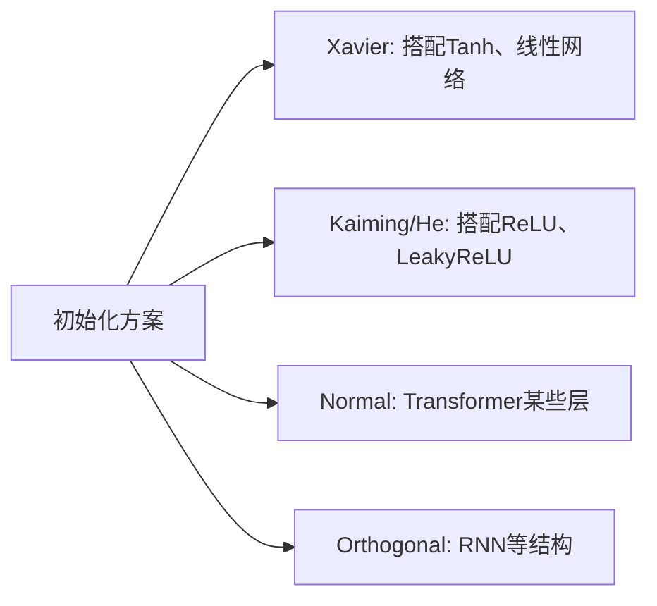

# 参数初始化

合理的初始化能减少梯度消失/爆炸的风险，加快训练收敛。



## 核心要点

* PyTorch 层通常已有合理默认初始化，但自定义模型或特殊结构时仍需要理解初始化
* Xavier 初始化：常搭配 Tanh、线性网络使用
* Kaiming（He）初始化：常搭配 ReLU、LeakyReLU 使用
* Normal（正态分布）初始化：Transformer 某些层常用
* Orthogonal（正交）初始化：RNN 等结构常用
* 自定义初始化通常通过 `model.apply(initialize_weights)` 遍历所有子模块并应用

## 代码示例

```python
def initialize_weights(module: nn.Module) -> None:
    if isinstance(module, nn.Linear):
        nn.init.xavier_uniform_(module.weight)
        if module.bias is not None:
            nn.init.zeros_(module.bias)

model.apply(initialize_weights)
```

---

## 本章测验

### 第 1 题

Xavier 初始化通常搭配哪类激活函数或结构使用？

- A. ReLU
- B. Tanh、线性网络
- C. LeakyReLU
- D. GELU

<details>
<summary>选择答案后查看结果</summary>

正确答案：B

答案解析：Xavier 初始化设计时假设激活函数近似线性（如 Tanh），常与 Tanh、线性网络搭配使用。

</details>

### 第 2 题

Kaiming（He）初始化常搭配哪类激活函数使用？

- A. Sigmoid
- B. Tanh
- C. ReLU、LeakyReLU
- D. Softmax

<details>
<summary>选择答案后查看结果</summary>

正确答案：C

答案解析：Kaiming 初始化针对 ReLU 类激活函数的特性（负数部分被截断）做了专门设计，因此常搭配 ReLU、LeakyReLU 使用。

</details>

### 第 3 题

`model.apply(initialize_weights)` 这行代码的作用是什么？

- A. 只对模型的第一层应用初始化函数
- B. 遍历模型内的所有子模块，并对每个子模块应用 initialize_weights 函数
- C. 训练结束后清空所有参数
- D. 自动切换模型到推理模式

<details>
<summary>选择答案后查看结果</summary>

正确答案：B

答案解析：`model.apply(fn)` 会递归遍历模型的所有子模块，对每一个子模块调用 fn，这样可以统一给符合条件的层（如 nn.Linear）设置自定义初始化方式。

</details>

### 第 4 题

代码示例中，为什么在初始化权重之后，还要对 `module.bias` 调用 `nn.init.zeros_`？

- A. 因为 bias 不需要初始化，这行代码没有实际作用
- B. 常见做法是把偏置初始化为 0，同时用 Xavier 等方法专门初始化权重矩阵
- C. 因为这样可以让模型自动跳过 bias 参数的训练
- D. 因为 bias 必须和 weight 使用完全相同的初始化方法

<details>
<summary>选择答案后查看结果</summary>

正确答案：B

答案解析：权重矩阵通常用 Xavier、Kaiming 等专门方法初始化以控制方差，而偏置项常见的做法是直接初始化为 0，两者处理方式并不需要一致。

</details>

### 第 5 题

关于参数初始化，下面哪种说法是正确的？

- A. PyTorch 的层完全没有默认初始化，必须每次手动设置
- B. PyTorch 层通常已有合理默认初始化，但自定义模型或特殊结构时仍需理解初始化原理
- C. 初始化方式对训练结果完全没有影响
- D. 只有 RNN 结构才需要关心初始化

<details>
<summary>选择答案后查看结果</summary>

正确答案：B

答案解析：PyTorch 内置层（如 nn.Linear）通常自带较为合理的默认初始化，但在自定义模型结构或使用特殊激活函数时，理解并适当调整初始化方式仍然很有必要。

</details>

<!-- QUIZ_DATA_START
{
  "chapter": "23",
  "questions": [
    {"id": 1, "question": "Xavier 初始化通常搭配哪类激活函数或结构使用？", "options": {"A": "ReLU", "B": "Tanh、线性网络", "C": "LeakyReLU", "D": "GELU"}, "answer": "B", "explanation": "Xavier 初始化设计时假设激活函数近似线性（如 Tanh），常与 Tanh、线性网络搭配使用。"},
    {"id": 2, "question": "Kaiming（He）初始化常搭配哪类激活函数使用？", "options": {"A": "Sigmoid", "B": "Tanh", "C": "ReLU、LeakyReLU", "D": "Softmax"}, "answer": "C", "explanation": "Kaiming 初始化针对 ReLU 类激活函数的特性做了专门设计，因此常搭配 ReLU、LeakyReLU 使用。"},
    {"id": 3, "question": "model.apply(initialize_weights) 这行代码的作用是什么？", "options": {"A": "只对模型的第一层应用初始化函数", "B": "遍历模型内的所有子模块，并对每个子模块应用 initialize_weights 函数", "C": "训练结束后清空所有参数", "D": "自动切换模型到推理模式"}, "answer": "B", "explanation": "model.apply(fn) 会递归遍历模型的所有子模块，对每一个子模块调用 fn。"},
    {"id": 4, "question": "代码示例中，为什么在初始化权重之后，还要对 module.bias 调用 nn.init.zeros_？", "options": {"A": "因为 bias 不需要初始化，这行代码没有实际作用", "B": "常见做法是把偏置初始化为 0，同时用 Xavier 等方法专门初始化权重矩阵", "C": "因为这样可以让模型自动跳过 bias 参数的训练", "D": "因为 bias 必须和 weight 使用完全相同的初始化方法"}, "answer": "B", "explanation": "权重矩阵通常用 Xavier、Kaiming 等专门方法初始化以控制方差，而偏置项常见的做法是直接初始化为 0。"},
    {"id": 5, "question": "关于参数初始化，下面哪种说法是正确的？", "options": {"A": "PyTorch 的层完全没有默认初始化，必须每次手动设置", "B": "PyTorch 层通常已有合理默认初始化，但自定义模型或特殊结构时仍需理解初始化原理", "C": "初始化方式对训练结果完全没有影响", "D": "只有 RNN 结构才需要关心初始化"}, "answer": "B", "explanation": "PyTorch 内置层通常自带较为合理的默认初始化，但在自定义模型结构或使用特殊激活函数时，理解并适当调整初始化方式仍然很有必要。"}
  ]
}
QUIZ_DATA_END -->
