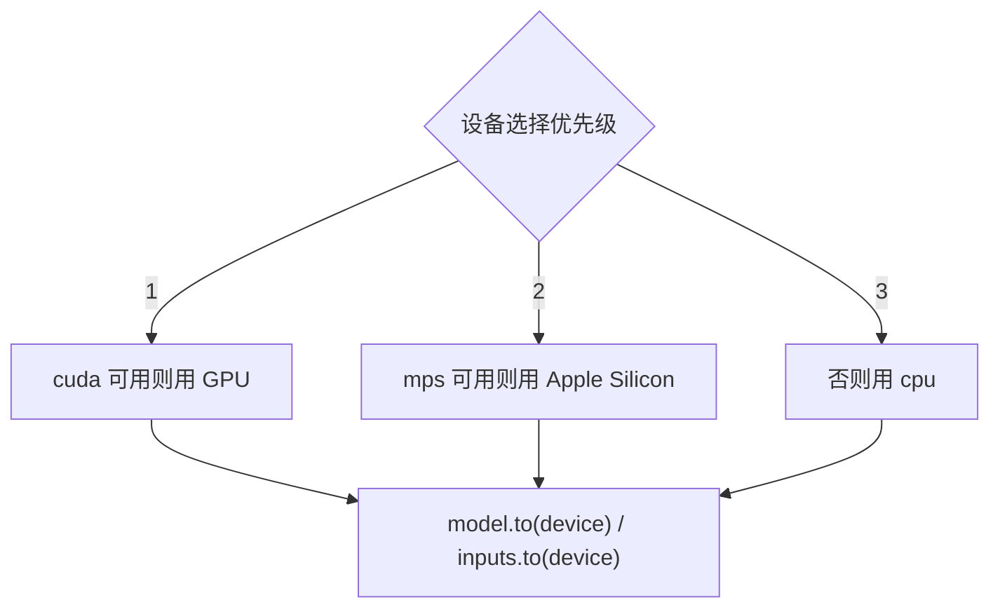

# GPU 训练与设备管理

正确选择和使用设备，是训练效率的重要基础。



## 核心要点

* 标准写法：`device = torch.device("cuda" if torch.cuda.is_available() else "cpu")`
* 模型和数据必须在同一个设备，否则报错 "Expected all tensors to be on the same device"
* Apple Silicon（Mac M 系列）可以检测 MPS：`torch.backends.mps.is_available()`，但部分操作支持或性能可能与 CUDA 不同
* `pin_memory=True` 主要对 CPU 到 CUDA GPU 的数据传输有帮助，需配合 `DataLoader`
* 异步拷贝：`inputs.to(device, non_blocking=True)`，配合 `pin_memory=True` 效果更好

## 代码示例

```python
if torch.cuda.is_available():
    device = torch.device("cuda")
elif torch.backends.mps.is_available():
    device = torch.device("mps")
else:
    device = torch.device("cpu")

model = model.to(device)

train_loader = DataLoader(
    dataset, batch_size=128, shuffle=True,
    num_workers=4, pin_memory=True,
)

inputs = inputs.to(device, non_blocking=True)
```

---

## 本章测验

### 第 1 题

选择训练设备的标准写法通常遵循怎样的优先级？

- A. 优先 CPU，其次 GPU
- B. 优先 GPU（cuda），其次 Apple Silicon（mps），最后 CPU
- C. 只能使用 CPU，不能使用 GPU
- D. 随机选择一个设备

<details>
<summary>选择答案后查看结果</summary>

正确答案：B

答案解析：常见写法是优先检测 CUDA 是否可用，其次检测 Apple Silicon 的 MPS 后端是否可用，最后才退回到 CPU。

</details>

### 第 2 题

“Expected all tensors to be on the same device” 报错通常是什么原因导致的？

- A. 学习率设置得太大
- B. 参与运算的 Tensor 分布在不同设备上，如一个在 CPU、一个在 GPU
- C. Dropout 比例设置错误
- D. 损失函数选错了类型

<details>
<summary>选择答案后查看结果</summary>

正确答案：B

答案解析：PyTorch 要求同一次运算涉及的所有 Tensor 都在同一个设备上，如果模型在 GPU 而输入数据还留在 CPU，就会触发这个报错。

</details>

### 第 3 题

在 Apple Silicon（Mac M 系列）设备上，可以通过什么代码检测是否可以使用 MPS 后端？

- A. `torch.cuda.is_available()`
- B. `torch.backends.mps.is_available()`
- C. `torch.device.check_mps()`
- D. `torch.mps_ready()`

<details>
<summary>选择答案后查看结果</summary>

正确答案：B

答案解析：文中提到可以用 `torch.backends.mps.is_available()` 判断当前设备是否支持 MPS 后端，用于在 Mac M 系列芯片上启用 GPU 加速。

</details>

### 第 4 题

`pin_memory=True` 主要对哪种数据传输场景有帮助？

- A. CPU 到 CPU 的数据拷贝
- B. CPU 到 CUDA GPU 的数据传输
- C. 磁盘到内存的文件读取
- D. GPU 到 GPU 之间的传输

<details>
<summary>选择答案后查看结果</summary>

正确答案：B

答案解析：pin_memory=True 会把 DataLoader 加载的数据放入固定（页锁定）内存，这主要能加速 CPU 到 CUDA GPU 的数据传输过程。

</details>

### 第 5 题

`inputs.to(device, non_blocking=True)` 中的 `non_blocking=True` 主要配合什么设置使用效果更好？

- A. `shuffle=True`
- B. `pin_memory=True`
- C. `num_workers=0`
- D. `requires_grad=False`

<details>
<summary>选择答案后查看结果</summary>

正确答案：B

答案解析：non_blocking=True 允许数据拷贝异步进行，这个效果通常需要配合 DataLoader 中的 pin_memory=True 才能真正发挥出加速效果。

</details>

<!-- QUIZ_DATA_START
{
  "chapter": "24",
  "questions": [
    {"id": 1, "question": "选择训练设备的标准写法通常遵循怎样的优先级？", "options": {"A": "优先 CPU，其次 GPU", "B": "优先 GPU（cuda），其次 Apple Silicon（mps），最后 CPU", "C": "只能使用 CPU，不能使用 GPU", "D": "随机选择一个设备"}, "answer": "B", "explanation": "常见写法是优先检测 CUDA 是否可用，其次检测 Apple Silicon 的 MPS 后端是否可用，最后才退回到 CPU。"},
    {"id": 2, "question": "“Expected all tensors to be on the same device” 报错通常是什么原因导致的？", "options": {"A": "学习率设置得太大", "B": "参与运算的 Tensor 分布在不同设备上，如一个在 CPU、一个在 GPU", "C": "Dropout 比例设置错误", "D": "损失函数选错了类型"}, "answer": "B", "explanation": "PyTorch 要求同一次运算涉及的所有 Tensor 都在同一个设备上，如果模型在 GPU 而输入数据还留在 CPU，就会触发这个报错。"},
    {"id": 3, "question": "在 Apple Silicon（Mac M 系列）设备上，可以通过什么代码检测是否可以使用 MPS 后端？", "options": {"A": "torch.cuda.is_available()", "B": "torch.backends.mps.is_available()", "C": "torch.device.check_mps()", "D": "torch.mps_ready()"}, "answer": "B", "explanation": "文中提到可以用 torch.backends.mps.is_available() 判断当前设备是否支持 MPS 后端。"},
    {"id": 4, "question": "pin_memory=True 主要对哪种数据传输场景有帮助？", "options": {"A": "CPU 到 CPU 的数据拷贝", "B": "CPU 到 CUDA GPU 的数据传输", "C": "磁盘到内存的文件读取", "D": "GPU 到 GPU 之间的传输"}, "answer": "B", "explanation": "pin_memory=True 会把 DataLoader 加载的数据放入固定（页锁定）内存，这主要能加速 CPU 到 CUDA GPU 的数据传输过程。"},
    {"id": 5, "question": "inputs.to(device, non_blocking=True) 中的 non_blocking=True 主要配合什么设置使用效果更好？", "options": {"A": "shuffle=True", "B": "pin_memory=True", "C": "num_workers=0", "D": "requires_grad=False"}, "answer": "B", "explanation": "non_blocking=True 允许数据拷贝异步进行，这个效果通常需要配合 DataLoader 中的 pin_memory=True 才能真正发挥出加速效果。"}
  ]
}
QUIZ_DATA_END -->
