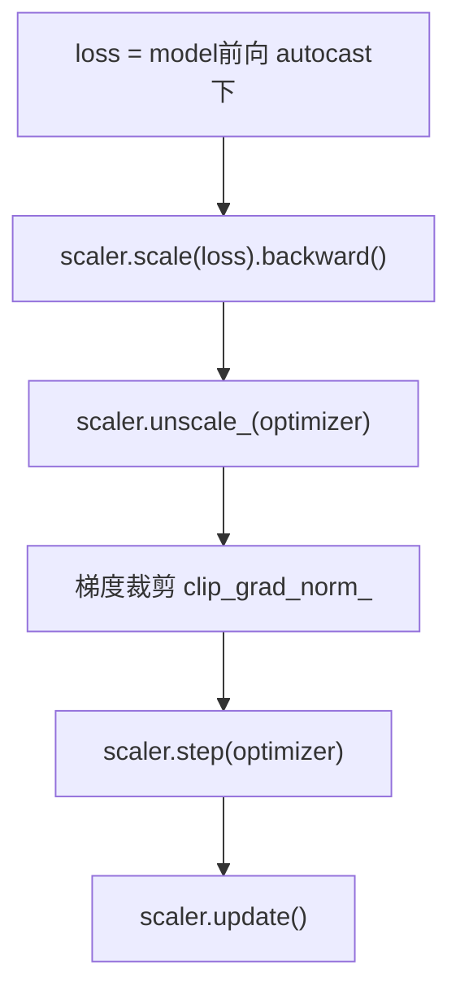

# 混合精度训练 AMP

混合精度训练能减少显存占用、提高 GPU 吞吐量，同时尽量保持训练稳定。



## 核心要点

* 默认训练常使用 FP32，混合精度会根据操作自动使用 FP16/BF16 或 FP32
* 优点：减少显存占用、提高 GPU 吞吐量、允许使用更大 batch_size
* CUDA 上使用 `torch.amp.GradScaler("cuda")` 配合 `torch.autocast(device_type="cuda", dtype=torch.float16)`
* 严格的执行顺序：scale loss → backward → unscale → 梯度裁剪 → optimizer step → scaler update
* BF16 数值范围比 FP16 更大，在支持 BF16 的硬件上通常更稳定，写法是把 dtype 换成 `torch.bfloat16`

## 代码示例

```python
scaler = torch.amp.GradScaler("cuda")

for inputs, targets in train_loader:
    inputs, targets = inputs.to(device), targets.to(device)
    optimizer.zero_grad(set_to_none=True)

    with torch.autocast(device_type="cuda", dtype=torch.float16):
        logits = model(inputs)
        loss = loss_function(logits, targets)

    scaler.scale(loss).backward()
    scaler.unscale_(optimizer)
    torch.nn.utils.clip_grad_norm_(model.parameters(), max_norm=1.0)
    scaler.step(optimizer)
    scaler.update()
```

---

## 本章测验

### 第 1 题

使用混合精度训练的主要好处不包括下面哪一项？

- A. 减少显存占用
- B. 提高 GPU 吞吐量
- C. 允许使用更大的 batch_size
- D. 保证模型准确率一定会提升

<details>
<summary>选择答案后查看结果</summary>

正确答案：D

答案解析：混合精度训练主要带来显存和速度上的收益，并不能保证模型准确率一定提升，准确率仍取决于模型结构、数据和训练策略本身。

</details>

### 第 2 题

在 AMP 训练循环中，正确的执行顺序是什么？

- A. `optimizer.step()` → `scaler.scale(loss).backward()` → `scaler.update()`
- B. `scaler.scale(loss).backward()` → `scaler.unscale_(optimizer)` → 梯度裁剪 → `scaler.step(optimizer)` → `scaler.update()`
- C. `scaler.update()` → `scaler.step(optimizer)` → `scaler.scale(loss).backward()`
- D. 梯度裁剪 → `scaler.scale(loss).backward()` → `optimizer.step()`

<details>
<summary>选择答案后查看结果</summary>

正确答案：B

答案解析：正确顺序是先缩放损失并反向传播，再反缩放梯度，然后做梯度裁剪，接着用 scaler.step 更新参数，最后调用 scaler.update 更新缩放系数。

</details>

### 第 3 题

`scaler.unscale_(optimizer)` 这一步的作用是什么？

- A. 把梯度重新放大，方便下一轮使用
- B. 在做梯度裁剪等操作前，把之前放大的梯度还原回真实尺度
- C. 完全跳过梯度计算
- D. 直接更新模型参数

<details>
<summary>选择答案后查看结果</summary>

正确答案：B

答案解析：AMP 训练中损失会被 scaler 放大以避免 FP16 数值下溢，unscale_ 会在梯度裁剪等操作之前把梯度还原回真实数值范围，否则裁剪的阈值会失去意义。

</details>

### 第 4 题

BF16 相比 FP16 的主要优势是什么？

- A. BF16 占用的显存比 FP16 更多
- B. BF16 的数值范围比 FP16 更大，在支持的硬件上通常更稳定
- C. BF16 不能用于混合精度训练
- D. BF16 只能在 CPU 上使用

<details>
<summary>选择答案后查看结果</summary>

正确答案：B

答案解析：BF16 保留了和 FP32 相近的指数位范围，数值范围比 FP16 更大，因此在数值稳定性上通常优于 FP16，前提是硬件支持。

</details>

### 第 5 题

关于混合精度训练，下面哪种说法是正确的？

- A. 训练全程只使用 FP16，完全不再使用 FP32
- B. 会根据不同操作自动选择使用 FP16/BF16 或 FP32
- C. 混合精度训练只能在 CPU 上使用
- D. 使用混合精度训练不需要任何额外代码改动

<details>
<summary>选择答案后查看结果</summary>

正确答案：B

答案解析：混合精度训练并不是简单地把所有计算都换成低精度，而是根据不同操作的数值敏感度，自动决定用 FP16/BF16 还是保留 FP32，以兼顾速度和数值稳定性。

</details>

<!-- QUIZ_DATA_START
{
  "chapter": "25",
  "questions": [
    {"id": 1, "question": "使用混合精度训练的主要好处不包括下面哪一项？", "options": {"A": "减少显存占用", "B": "提高 GPU 吞吐量", "C": "允许使用更大的 batch_size", "D": "保证模型准确率一定会提升"}, "answer": "D", "explanation": "混合精度训练主要带来显存和速度上的收益，并不能保证模型准确率一定提升。"},
    {"id": 2, "question": "在 AMP 训练循环中，正确的执行顺序是什么？", "options": {"A": "optimizer.step() → scaler.scale(loss).backward() → scaler.update()", "B": "scaler.scale(loss).backward() → scaler.unscale_(optimizer) → 梯度裁剪 → scaler.step(optimizer) → scaler.update()", "C": "scaler.update() → scaler.step(optimizer) → scaler.scale(loss).backward()", "D": "梯度裁剪 → scaler.scale(loss).backward() → optimizer.step()"}, "answer": "B", "explanation": "正确顺序是先缩放损失并反向传播，再反缩放梯度，然后做梯度裁剪，接着用 scaler.step 更新参数，最后调用 scaler.update。"},
    {"id": 3, "question": "scaler.unscale_(optimizer) 这一步的作用是什么？", "options": {"A": "把梯度重新放大，方便下一轮使用", "B": "在做梯度裁剪等操作前，把之前放大的梯度还原回真实尺度", "C": "完全跳过梯度计算", "D": "直接更新模型参数"}, "answer": "B", "explanation": "AMP 训练中损失会被 scaler 放大以避免 FP16 数值下溢，unscale_ 会在梯度裁剪等操作之前把梯度还原回真实数值范围。"},
    {"id": 4, "question": "BF16 相比 FP16 的主要优势是什么？", "options": {"A": "BF16 占用的显存比 FP16 更多", "B": "BF16 的数值范围比 FP16 更大，在支持的硬件上通常更稳定", "C": "BF16 不能用于混合精度训练", "D": "BF16 只能在 CPU 上使用"}, "answer": "B", "explanation": "BF16 保留了和 FP32 相近的指数位范围，数值范围比 FP16 更大，因此在数值稳定性上通常优于 FP16。"},
    {"id": 5, "question": "关于混合精度训练，下面哪种说法是正确的？", "options": {"A": "训练全程只使用 FP16，完全不再使用 FP32", "B": "会根据不同操作自动选择使用 FP16/BF16 或 FP32", "C": "混合精度训练只能在 CPU 上使用", "D": "使用混合精度训练不需要任何额外代码改动"}, "answer": "B", "explanation": "混合精度训练会根据不同操作的数值敏感度，自动决定用 FP16/BF16 还是保留 FP32。"}
  ]
}
QUIZ_DATA_END -->
