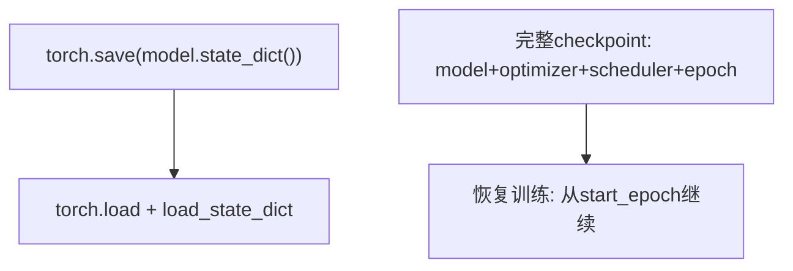

# 模型保存与恢复

推荐保存 state_dict，同时了解如何保存完整训练状态以便恢复训练。



## 核心要点

* 推荐保存方式：`torch.save(model.state_dict(), "model.pt")`
* 加载：先实例化模型结构，再 `model.load_state_dict(state_dict)`，并设置 `weights_only=True`、`map_location` 控制目标设备
* 仅保存模型参数不能完整恢复训练状态；需要恢复训练时应保存完整 checkpoint：模型参数、优化器状态、调度器状态、当前 epoch、最优验证损失等
* 恢复训练时依次加载 model_state_dict、optimizer_state_dict、scheduler_state_dict，并从 `checkpoint["epoch"] + 1` 继续
* 对不可信来源的模型文件，不要随意反序列化完整 Python 对象（即不要轻易设置 `weights_only=False` 加载来源不明的文件）

## 代码示例

```python
torch.save(model.state_dict(), "model.pt")

state_dict = torch.load("model.pt", map_location="cpu", weights_only=True)
model.load_state_dict(state_dict)
model.eval()

checkpoint = {
    "epoch": epoch,
    "model_state_dict": model.state_dict(),
    "optimizer_state_dict": optimizer.state_dict(),
    "scheduler_state_dict": scheduler.state_dict(),
    "best_validation_loss": best_validation_loss,
}
torch.save(checkpoint, "checkpoint.pt")
```

---

## 本章测验

### 第 1 题

保存 PyTorch 模型时，文中推荐的常规做法是什么？

- A. 保存整个模型对象
- B. 保存 `model.state_dict()`
- C. 只保存模型的第一层
- D. 保存模型的源代码文件

<details>
<summary>选择答案后查看结果</summary>

正确答案：B

答案解析：推荐做法是保存 state_dict（参数名到参数值的字典），加载时先实例化模型结构，再用 load_state_dict 恢复参数，这样更灵活、也更安全。

</details>

### 第 2 题

只保存 `model.state_dict()`，能否完整恢复中断的训练过程？

- A. 可以，state_dict 已经包含了训练所需的一切
- B. 不可以，只保存模型参数，无法恢复优化器状态、调度器状态和已训练轮数等信息
- C. 可以，但只能在同一台机器上恢复
- D. 无法判断，取决于模型大小

<details>
<summary>选择答案后查看结果</summary>

正确答案：B

答案解析：state_dict 只包含模型参数，如果要完整恢复训练（比如继续未完成的训练），还需要保存优化器状态、调度器状态、当前 epoch 等信息，即完整 checkpoint。

</details>

### 第 3 题

完整 checkpoint 通常应该包含哪些内容？

- A. 只需要 model_state_dict
- B. model_state_dict、optimizer_state_dict、scheduler_state_dict、当前 epoch 等信息
- C. 只需要训练数据本身
- D. 只需要最终的准确率数值

<details>
<summary>选择答案后查看结果</summary>

正确答案：B

答案解析：为了能从中断处继续训练，checkpoint 通常需要包含模型参数、优化器状态、调度器状态、当前 epoch 以及最优验证损失等，缺一不可。

</details>

### 第 4 题

加载 GPU 上保存的模型到 CPU 环境时，应该使用哪个参数控制目标设备？

- A. `device_target`
- B. `map_location`
- C. `to_device`
- D. `load_device`

<details>
<summary>选择答案后查看结果</summary>

正确答案：B

答案解析：`torch.load(..., map_location=...)` 可以控制加载后的 Tensor 被放置在哪个设备上，比如设置为 "cpu" 就能把原本在 GPU 上保存的参数加载到 CPU。

</details>

### 第 5 题

对不可信来源的模型文件，文中给出的安全提醒是什么？

- A. 直接用 weights_only=False 完整加载，没有任何风险
- B. 不要随意反序列化完整 Python 对象，需要谨慎处理
- C. 不可信来源的文件无法被 PyTorch 加载
- D. 只要文件后缀是 .pt 就一定是安全的

<details>
<summary>选择答案后查看结果</summary>

正确答案：B

答案解析：反序列化不可信文件中的完整 Python 对象可能带来安全风险，因此文中提醒对不可信来源的模型文件要谨慎处理，不要随意完整反序列化。

</details>

<!-- QUIZ_DATA_START
{
  "chapter": "26",
  "questions": [
    {"id": 1, "question": "保存 PyTorch 模型时，文中推荐的常规做法是什么？", "options": {"A": "保存整个模型对象", "B": "保存 model.state_dict()", "C": "只保存模型的第一层", "D": "保存模型的源代码文件"}, "answer": "B", "explanation": "推荐做法是保存 state_dict，加载时先实例化模型结构，再用 load_state_dict 恢复参数，这样更灵活、也更安全。"},
    {"id": 2, "question": "只保存 model.state_dict()，能否完整恢复中断的训练过程？", "options": {"A": "可以，state_dict 已经包含了训练所需的一切", "B": "不可以，只保存模型参数，无法恢复优化器状态、调度器状态和已训练轮数等信息", "C": "可以，但只能在同一台机器上恢复", "D": "无法判断，取决于模型大小"}, "answer": "B", "explanation": "state_dict 只包含模型参数，如果要完整恢复训练，还需要保存优化器状态、调度器状态、当前 epoch 等信息。"},
    {"id": 3, "question": "完整 checkpoint 通常应该包含哪些内容？", "options": {"A": "只需要 model_state_dict", "B": "model_state_dict、optimizer_state_dict、scheduler_state_dict、当前 epoch 等信息", "C": "只需要训练数据本身", "D": "只需要最终的准确率数值"}, "answer": "B", "explanation": "为了能从中断处继续训练，checkpoint 通常需要包含模型参数、优化器状态、调度器状态、当前 epoch 以及最优验证损失等。"},
    {"id": 4, "question": "加载 GPU 上保存的模型到 CPU 环境时，应该使用哪个参数控制目标设备？", "options": {"A": "device_target", "B": "map_location", "C": "to_device", "D": "load_device"}, "answer": "B", "explanation": "torch.load(..., map_location=...) 可以控制加载后的 Tensor 被放置在哪个设备上。"},
    {"id": 5, "question": "对不可信来源的模型文件，文中给出的安全提醒是什么？", "options": {"A": "直接用 weights_only=False 完整加载，没有任何风险", "B": "不要随意反序列化完整 Python 对象，需要谨慎处理", "C": "不可信来源的文件无法被 PyTorch 加载", "D": "只要文件后缀是 .pt 就一定是安全的"}, "answer": "B", "explanation": "反序列化不可信文件中的完整 Python 对象可能带来安全风险，因此需要谨慎处理，不要随意完整反序列化。"}
  ]
}
QUIZ_DATA_END -->
