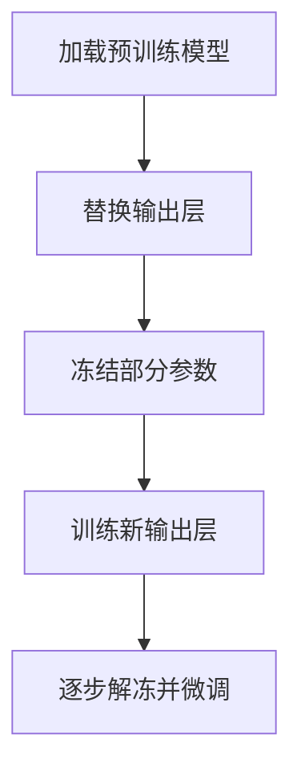

# 迁移学习实战

实际项目通常不从零训练大型模型，而是基于预训练模型微调。



## 核心要点

* 从 `torchvision.models` 加载预训练权重，例如 `resnet18(weights=ResNet18_Weights.DEFAULT)`
* 冻结原有参数：遍历 `model.parameters()`，设置 `parameter.requires_grad = False`
* 替换输出层：`model.fc = nn.Linear(number_of_features, number_of_classes)`，新层默认 `requires_grad=True`
* 优化器只应该优化可训练参数：`filter(lambda p: p.requires_grad, model.parameters())`
* 后续可以逐步解冻更多层（如 `model.layer4`）进行微调，通常搭配更小的学习率

## 代码示例

```python
from torchvision.models import ResNet18_Weights, resnet18

weights = ResNet18_Weights.DEFAULT
model = resnet18(weights=weights)

for parameter in model.parameters():
    parameter.requires_grad = False

number_of_features = model.fc.in_features
model.fc = nn.Linear(number_of_features, number_of_classes)

optimizer = torch.optim.AdamW(
    filter(lambda p: p.requires_grad, model.parameters()),
    lr=1e-3,
)

# 后续解冻更深层
for parameter in model.layer4.parameters():
    parameter.requires_grad = True
```

---

## 本章测验

### 第 1 题

迁移学习的第一步通常是什么？

- A. 直接从零开始随机初始化一个全新模型
- B. 加载一个已经在大规模数据集上训练好的预训练模型
- C. 立刻删除模型的所有层
- D. 先训练输出层，再加载预训练权重

<details>
<summary>选择答案后查看结果</summary>

正确答案：B

答案解析：迁移学习的核心思路是站在巨人的肩膀上，先加载一个已经学到通用特征的预训练模型，再针对新任务做适配。

</details>

### 第 2 题

为什么迁移学习初期通常要冻结预训练模型的大部分参数？

- A. 冻结参数可以让模型运行得更快
- B. 避免破坏预训练模型已经学到的通用特征，让新添加的输出层先适配当前任务
- C. 冻结参数是为了减少模型的层数
- D. 这样可以自动增加训练数据量

<details>
<summary>选择答案后查看结果</summary>

正确答案：B

答案解析：预训练参数中已经包含了从大规模数据中学到的通用特征，初期冻结这些参数可以避免在新任务数据量较小时被破坏，让新输出层先学会利用这些特征。

</details>

### 第 3 题

替换输出层后，为什么优化器只传入 `filter(lambda p: p.requires_grad, model.parameters())`？

- A. 这样可以让所有参数都被训练
- B. 只把需要训练的参数（未被冻结的部分）交给优化器，避免浪费计算资源去更新冻结的参数
- C. 这样可以自动增加学习率
- D. 这个写法没有实际意义，可以随意省略

<details>
<summary>选择答案后查看结果</summary>

正确答案：B

答案解析：被冻结的参数 requires_grad=False，不会计算梯度，把它们也传给优化器没有意义，用 filter 只挑出需要更新的参数可以让代码更清晰、避免不必要的开销。

</details>

### 第 4 题

`model.fc = nn.Linear(number_of_features, number_of_classes)` 这一步做了什么？

- A. 删除模型的所有卷积层
- B. 把原来的输出层替换成适配当前任务类别数的新输出层
- C. 冻结新输出层的参数
- D. 加载一个全新的预训练权重

<details>
<summary>选择答案后查看结果</summary>

正确答案：B

答案解析：预训练模型原本的输出层通常对应它训练时的类别数量，替换成新的 nn.Linear 层可以让输出维度匹配当前任务的类别数。

</details>

### 第 5 题

在“逐步解冻并微调”阶段，通常建议使用怎样的学习率？

- A. 比训练新输出层时更大的学习率
- B. 和从零训练完全相同的学习率
- C. 通常使用更小的学习率
- D. 学习率不需要调整

<details>
<summary>选择答案后查看结果</summary>

正确答案：C

答案解析：解冻更深层参数进行微调时，这些参数已经比较接近合理值，通常需要使用更小的学习率，避免大幅度更新破坏已经学到的特征。

</details>

<!-- QUIZ_DATA_START
{
  "chapter": "28",
  "questions": [
    {"id": 1, "question": "迁移学习的第一步通常是什么？", "options": {"A": "直接从零开始随机初始化一个全新模型", "B": "加载一个已经在大规模数据集上训练好的预训练模型", "C": "立刻删除模型的所有层", "D": "先训练输出层，再加载预训练权重"}, "answer": "B", "explanation": "迁移学习的核心思路是先加载一个已经学到通用特征的预训练模型，再针对新任务做适配。"},
    {"id": 2, "question": "为什么迁移学习初期通常要冻结预训练模型的大部分参数？", "options": {"A": "冻结参数可以让模型运行得更快", "B": "避免破坏预训练模型已经学到的通用特征，让新添加的输出层先适配当前任务", "C": "冻结参数是为了减少模型的层数", "D": "这样可以自动增加训练数据量"}, "answer": "B", "explanation": "初期冻结预训练参数可以避免在新任务数据量较小时被破坏，让新输出层先学会利用这些特征。"},
    {"id": 3, "question": "替换输出层后，为什么优化器只传入 filter(lambda p: p.requires_grad, model.parameters())？", "options": {"A": "这样可以让所有参数都被训练", "B": "只把需要训练的参数（未被冻结的部分）交给优化器，避免浪费计算资源去更新冻结的参数", "C": "这样可以自动增加学习率", "D": "这个写法没有实际意义，可以随意省略"}, "answer": "B", "explanation": "被冻结的参数不会计算梯度，把它们也传给优化器没有意义。"},
    {"id": 4, "question": "model.fc = nn.Linear(number_of_features, number_of_classes) 这一步做了什么？", "options": {"A": "删除模型的所有卷积层", "B": "把原来的输出层替换成适配当前任务类别数的新输出层", "C": "冻结新输出层的参数", "D": "加载一个全新的预训练权重"}, "answer": "B", "explanation": "预训练模型原本的输出层通常对应它训练时的类别数量，替换成新的 nn.Linear 层可以让输出维度匹配当前任务的类别数。"},
    {"id": 5, "question": "在“逐步解冻并微调”阶段，通常建议使用怎样的学习率？", "options": {"A": "比训练新输出层时更大的学习率", "B": "和从零训练完全相同的学习率", "C": "通常使用更小的学习率", "D": "学习率不需要调整"}, "answer": "C", "explanation": "解冻更深层参数进行微调时，这些参数已经比较接近合理值，通常需要使用更小的学习率。"}
  ]
}
QUIZ_DATA_END -->
