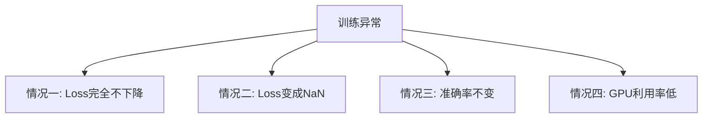

# 训练问题诊断：Loss 不下降、NaN、GPU 利用率低

把前面所有章节的知识串联起来，用来排查实际训练中最常见的四类问题。



## 核心要点

**情况一：Loss 完全不下降**，按顺序检查：数据和标签是否对应、参数 `requires_grad` 是否为 True、是否调用了 `loss.backward()`、是否调用了 `optimizer.step()`、学习率是否合适、输出和标签 shape 是否正确、损失函数是否匹配任务

**情况二：Loss 是 NaN**，可能原因：学习率太大、除以零、log(0)、exp 溢出、梯度爆炸、输入中已存在 NaN/Inf、FP16 数值溢出；可用 `assert torch.isfinite(inputs).all()` 和逐参数检查梯度是否有限来定位

**情况三：训练准确率不变**，检查：标签是否从 0 开始、argmax 的维度是否正确、最后一层输出类别数是否正确、参数是否被意外冻结、优化器是否拿到了正确参数

**情况四：GPU 利用率低**，可能原因：数据读取慢、`num_workers` 太少、batch_size 太小、CPU 数据增强过重、频繁调用 `.item()` 或打印日志；可尝试 `num_workers`、`pin_memory=True`、`persistent_workers=True`

## 代码示例

```python
assert torch.isfinite(inputs).all()
assert torch.isfinite(loss)

for name, parameter in model.named_parameters():
    if parameter.grad is not None and not torch.isfinite(parameter.grad).all():
        print("Invalid gradient:", name)

for name, parameter in model.named_parameters():
    print(name, parameter.requires_grad)
```

---

## 本章测验

### 第 1 题

排查“Loss 完全不下降”问题时，下面哪一项不在建议的检查清单中？

- A. 是否调用了 loss.backward()
- B. 是否调用了 optimizer.step()
- C. 数据和标签是否对应
- D. 显示器分辨率是否设置正确

<details>
<summary>选择答案后查看结果</summary>

正确答案：D

答案解析：显示器分辨率与模型训练完全无关，真正需要检查的是数据标签对应关系、是否正确调用 backward 和 step、学习率、shape 以及损失函数是否匹配任务等。

</details>

### 第 2 题

Loss 出现 NaN，下面哪一项不是文中列出的常见原因？

- A. 学习率太大
- B. 梯度爆炸
- C. 输入中已经存在 NaN/Inf
- D. batch_size 设置为偶数

<details>
<summary>选择答案后查看结果</summary>

正确答案：D

答案解析：batch_size 是否为偶数与 NaN 没有直接关系；学习率太大、梯度爆炸、输入本身已包含 NaN/Inf、log(0)、除以零等才是常见诱因。

</details>

### 第 3 题

训练准确率一直不变，最不应该优先怀疑下面哪一项？

- A. 标签是否从 0 开始
- B. argmax 使用的维度是否正确
- C. 参数是否被意外冻结
- D. 训练用的编程语言版本号

<details>
<summary>选择答案后查看结果</summary>

正确答案：D

答案解析：编程语言版本号与训练准确率不变没有直接关系，应优先检查标签编码、argmax 维度、类别数设置、参数是否被冻结、优化器是否拿到正确参数等。

</details>

### 第 4 题

GPU 利用率低时，下面哪种做法最可能有帮助？

- A. 把 num_workers 设置为 0，并且频繁调用 print 打印日志
- B. 适当增大 num_workers，并设置 pin_memory=True
- C. 把 batch_size 无限缩小
- D. 关闭所有数据预处理

<details>
<summary>选择答案后查看结果</summary>

正确答案：B

答案解析：当数据读取成为瓶颈时，适当增大 num_workers 让更多进程并行加载数据，同时开启 pin_memory 加速 CPU 到 GPU 的数据传输，通常能有效提升 GPU 利用率。

</details>

### 第 5 题

用 `assert torch.isfinite(inputs).all()` 这行代码的目的是什么？

- A. 检查输入数据中是否存在 NaN 或 Inf 这类非有限值
- B. 检查模型参数总量
- C. 检查学习率是否设置正确
- D. 检查 batch_size 是否过大

<details>
<summary>选择答案后查看结果</summary>

正确答案：A

答案解析：`torch.isfinite` 会判断张量中的每个元素是否是有限数值（既不是 NaN 也不是 Inf），这行断言常用于尽早发现输入数据本身是否已经包含异常值，帮助定位 NaN 问题的源头。

</details>

<!-- QUIZ_DATA_START
{
  "chapter": "29",
  "questions": [
    {"id": 1, "question": "排查“Loss 完全不下降”问题时，下面哪一项不在建议的检查清单中？", "options": {"A": "是否调用了 loss.backward()", "B": "是否调用了 optimizer.step()", "C": "数据和标签是否对应", "D": "显示器分辨率是否设置正确"}, "answer": "D", "explanation": "显示器分辨率与模型训练完全无关，真正需要检查的是数据标签对应关系、是否正确调用 backward 和 step、学习率、shape 以及损失函数是否匹配任务等。"},
    {"id": 2, "question": "Loss 出现 NaN，下面哪一项不是文中列出的常见原因？", "options": {"A": "学习率太大", "B": "梯度爆炸", "C": "输入中已经存在 NaN/Inf", "D": "batch_size 设置为偶数"}, "answer": "D", "explanation": "batch_size 是否为偶数与 NaN 没有直接关系；学习率太大、梯度爆炸、输入本身已包含 NaN/Inf 等才是常见诱因。"},
    {"id": 3, "question": "训练准确率一直不变，最不应该优先怀疑下面哪一项？", "options": {"A": "标签是否从 0 开始", "B": "argmax 使用的维度是否正确", "C": "参数是否被意外冻结", "D": "训练用的编程语言版本号"}, "answer": "D", "explanation": "编程语言版本号与训练准确率不变没有直接关系，应优先检查标签编码、argmax 维度、类别数设置、参数是否被冻结等。"},
    {"id": 4, "question": "GPU 利用率低时，下面哪种做法最可能有帮助？", "options": {"A": "把 num_workers 设置为 0，并且频繁调用 print 打印日志", "B": "适当增大 num_workers，并设置 pin_memory=True", "C": "把 batch_size 无限缩小", "D": "关闭所有数据预处理"}, "answer": "B", "explanation": "当数据读取成为瓶颈时，适当增大 num_workers 让更多进程并行加载数据，同时开启 pin_memory 加速数据传输，通常能有效提升 GPU 利用率。"},
    {"id": 5, "question": "用 assert torch.isfinite(inputs).all() 这行代码的目的是什么？", "options": {"A": "检查输入数据中是否存在 NaN 或 Inf 这类非有限值", "B": "检查模型参数总量", "C": "检查学习率是否设置正确", "D": "检查 batch_size 是否过大"}, "answer": "A", "explanation": "torch.isfinite 会判断张量中的每个元素是否是有限数值，这行断言常用于尽早发现输入数据本身是否已经包含异常值。"}
  ]
}
QUIZ_DATA_END -->
