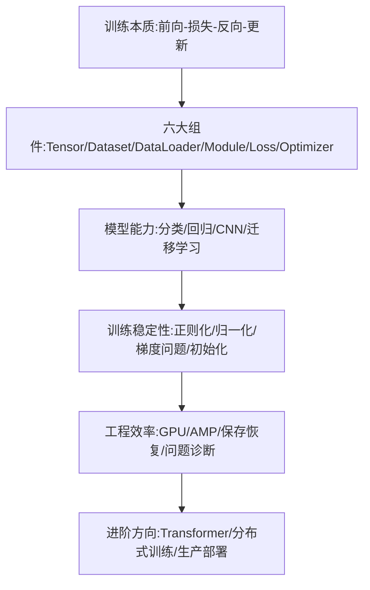

# 课程总结与进阶学习路线

回顾整个课程的知识结构，并展望进一步的学习方向。



## 核心要点：知识结构回顾

* **训练本质**：前向传播 → 计算损失 → 反向传播 → 更新参数，这四步是一切模型训练的核心
* **六大组件**：Tensor 保存数据和梯度，Dataset/DataLoader 负责数据供给，nn.Module 定义结构，Loss 衡量差距，Optimizer 负责更新
* **模型能力**：从线性回归到多分类、二分类，再到 CNN 处理图像、迁移学习复用预训练知识
* **训练稳定性**：过拟合/欠拟合的判断，Weight Decay/Dropout/Early Stopping 等正则化手段，BatchNorm/LayerNorm 归一化，梯度消失/爆炸的应对，合理的参数初始化
* **工程效率**：GPU 设备管理、混合精度训练 AMP、模型保存与恢复、系统化的训练问题诊断方法

## 关键流程回顾

```text
数据 → Dataset/DataLoader → 模型(nn.Module)
   → 前向传播得到输出 → 损失函数计算误差
   → 反向传播得到梯度 → 优化器更新参数
   → 验证集评估 → 判断过拟合/欠拟合 → 调整策略
   → 保存最优模型 → 部署或迁移学习复用
```

## 可以继续研究的方向

* Transformer 结构：Self-Attention、Multi-Head Attention、Position Encoding
* 分布式训练：DistributedDataParallel（DDP）、FSDP，用于多 GPU / 大模型训练
* `torch.compile`：尝试捕获和优化模型执行图，改善运行性能
* 生产工程：模型服务、监控、数据漂移、自动化重新训练

---

## 本章测验（综合）

### 第 1 题

一次完整的训练迭代（Iteration），按正确顺序应该经历下面哪个流程？

- A. 更新参数 → 前向传播 → 计算损失 → 反向传播
- B. 前向传播 → 计算损失 → 反向传播 → 更新参数
- C. 计算损失 → 更新参数 → 前向传播 → 反向传播
- D. 反向传播 → 计算损失 → 前向传播 → 更新参数

<details>
<summary>选择答案后查看结果</summary>

正确答案：B

答案解析：这是贯穿全课程最核心的循环：先用当前参数做前向传播得到预测，再计算损失，然后反向传播得到梯度，最后用梯度更新参数。

</details>

### 第 2 题

多分类任务用 CrossEntropyLoss、二分类任务用 BCEWithLogitsLoss 时，有一条共同的重要原则是什么？

- A. 训练前都需要手动先做一次 Softmax 或 Sigmoid
- B. 都不需要手动提前做 Softmax/Sigmoid，因为损失函数内部已经包含
- C. 两者可以随意互换使用，没有区别
- D. 两者都只能用于回归任务

<details>
<summary>选择答案后查看结果</summary>

正确答案：B

答案解析：CrossEntropyLoss 内部包含 Softmax，BCEWithLogitsLoss 内部包含 Sigmoid，训练时都应该直接传入原始 logits，不要手动重复计算概率。

</details>

### 第 3 题

判断模型处于“过拟合”还是“欠拟合”，最核心的依据是什么？

- A. 只看训练集上的损失是否足够小
- B. 同时对比训练集和验证集的表现走势
- C. 只看模型的参数量大小
- D. 只看训练用了多少个 Epoch

<details>
<summary>选择答案后查看结果</summary>

正确答案：B

答案解析：欠拟合表现为训练集和验证集都差，过拟合表现为训练集好但验证集变差，因此必须同时观察两者的走势才能准确判断。

</details>

### 第 4 题

课程中反复强调的“三大匹配”排查思路，指的是下面哪一组？

- A. 学习率、batch_size、Epoch 数量
- B. shape、dtype、device
- C. 训练集、验证集、测试集
- D. 卷积核大小、步长、填充

<details>
<summary>选择答案后查看结果</summary>

正确答案：B

答案解析：课程中提到训练报错大多可以归为 shape 不匹配、dtype 不匹配、device 不匹配三类，排查时应优先打印这三个属性。

</details>

### 第 5 题

如果要在单张 GPU 放不下的大模型上进行训练，课程中提到应优先考虑的分布式方案是什么？

- A. DataParallel
- B. FSDP（将参数、梯度、优化器状态分片）
- C. 只使用 CPU 训练
- D. 直接减少模型层数直到能放进单张 GPU

<details>
<summary>选择答案后查看结果</summary>

正确答案：B

答案解析：DDP 每个进程都保存完整模型副本，适合模型能放入单卡的场景；而 FSDP 会将参数、梯度、优化器状态分片到多个 GPU，更适合单卡放不下的大模型。

</details>

<!-- QUIZ_DATA_START
{
  "chapter": "30",
  "questions": [
    {"id": 1, "question": "一次完整的训练迭代（Iteration），按正确顺序应该经历下面哪个流程？", "options": {"A": "更新参数 → 前向传播 → 计算损失 → 反向传播", "B": "前向传播 → 计算损失 → 反向传播 → 更新参数", "C": "计算损失 → 更新参数 → 前向传播 → 反向传播", "D": "反向传播 → 计算损失 → 前向传播 → 更新参数"}, "answer": "B", "explanation": "这是贯穿全课程最核心的循环：先前向传播得到预测，再计算损失，然后反向传播得到梯度，最后用梯度更新参数。"},
    {"id": 2, "question": "多分类任务用 CrossEntropyLoss、二分类任务用 BCEWithLogitsLoss 时，有一条共同的重要原则是什么？", "options": {"A": "训练前都需要手动先做一次 Softmax 或 Sigmoid", "B": "都不需要手动提前做 Softmax/Sigmoid，因为损失函数内部已经包含", "C": "两者可以随意互换使用，没有区别", "D": "两者都只能用于回归任务"}, "answer": "B", "explanation": "CrossEntropyLoss 内部包含 Softmax，BCEWithLogitsLoss 内部包含 Sigmoid，训练时都应该直接传入原始 logits。"},
    {"id": 3, "question": "判断模型处于“过拟合”还是“欠拟合”，最核心的依据是什么？", "options": {"A": "只看训练集上的损失是否足够小", "B": "同时对比训练集和验证集的表现走势", "C": "只看模型的参数量大小", "D": "只看训练用了多少个 Epoch"}, "answer": "B", "explanation": "欠拟合表现为训练集和验证集都差，过拟合表现为训练集好但验证集变差，因此必须同时观察两者的走势。"},
    {"id": 4, "question": "课程中反复强调的“三大匹配”排查思路，指的是下面哪一组？", "options": {"A": "学习率、batch_size、Epoch 数量", "B": "shape、dtype、device", "C": "训练集、验证集、测试集", "D": "卷积核大小、步长、填充"}, "answer": "B", "explanation": "课程中提到训练报错大多可以归为 shape 不匹配、dtype 不匹配、device 不匹配三类。"},
    {"id": 5, "question": "如果要在单张 GPU 放不下的大模型上进行训练，课程中提到应优先考虑的分布式方案是什么？", "options": {"A": "DataParallel", "B": "FSDP（将参数、梯度、优化器状态分片）", "C": "只使用 CPU 训练", "D": "直接减少模型层数直到能放进单张 GPU"}, "answer": "B", "explanation": "DDP 每个进程都保存完整模型副本，适合模型能放入单卡的场景；FSDP 会将参数、梯度、优化器状态分片到多个 GPU，更适合单卡放不下的大模型。"}
  ]
}
QUIZ_DATA_END -->
