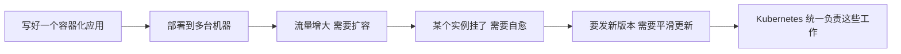

# 为什么要学习 Kubernetes

一句话：应用越来越多、越来越复杂，人工管理容器会很快失控，Kubernetes 就是用来自动化这件事的系统。

## 核心要点

* Kubernetes 是一个容器编排系统
* 它负责部署、扩缩、自愈、更新应用
* 本课程按照 Kubernetes 官方教程的结构展开
* 学习顺序：基础 -> 配置 -> 无状态应用 -> 有状态应用 -> 服务 -> 安全 -> 集群管理
* 每一章都对应官方教程里的一个真实场景
