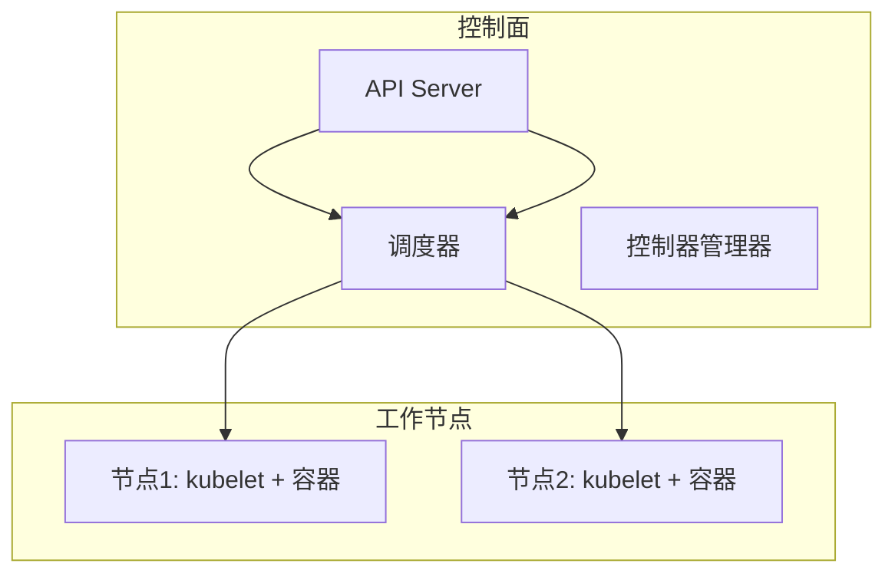

# Kubernetes 基础：集群与核心概念

一句话：一个 Kubernetes 集群由控制面和工作节点组成，控制面做决策，节点负责真正运行容器。

## 核心要点

* 集群 = 控制面 + 一组工作节点
* API Server 是所有操作的统一入口
* 调度器决定 Pod 应该跑在哪个节点上
* kubelet 是节点上负责实际管理容器的代理
* 学习环境常用 Minikube 在本地模拟一个完整集群
