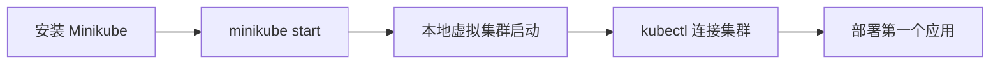

# 你好 Minikube：创建你的第一个集群

一句话：Minikube 让你在自己的电脑上一条命令启动一个真实可用的 Kubernetes 集群。

## 核心要点

* `minikube start` 一条命令启动本地集群
* Minikube 会自动配置好 kubectl 的连接
* `kubectl cluster-info` 用来确认集群已经就绪
* `minikube dashboard` 可以打开可视化的仪表盘
* 这是后续所有教程的共同起点
