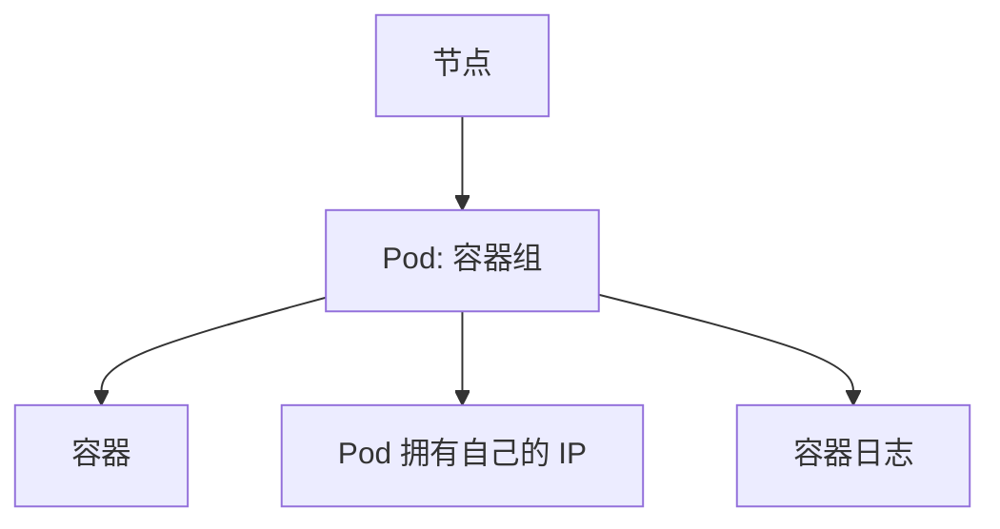

# 了解你的应用：查看 Pod 和节点

一句话：Pod 是 Kubernetes 里最小的部署单元，了解它的状态是排查一切问题的第一步。

## 核心要点

* Pod 是一个或多个共享网络和存储的容器的集合
* `kubectl get pods` 查看当前所有 Pod 及状态
* `kubectl describe pod` 查看某个 Pod 的详细事件
* `kubectl logs` 查看容器输出的日志
* 每个 Pod 拥有独立的集群内部 IP
