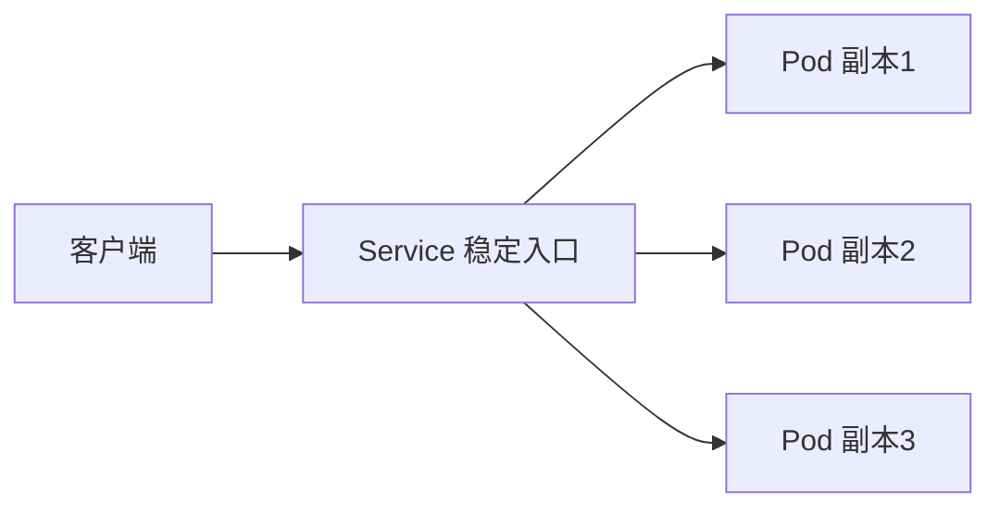

# 暴露应用：使用 Service

一句话：Pod 会重建、IP 会变化，Service 提供一个稳定的入口，让别人始终能找到你的应用。

## 核心要点

* Pod 的 IP 不稳定，重建后会变化
* Service 提供一个固定的访问入口
* Service 通过标签选择器找到对应的 Pod
* `kubectl expose deployment` 快速创建 Service
* Service 会自动把流量分发到多个 Pod
