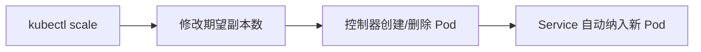

# 扩缩应用：运行多个实例

一句话：流量变大时，只需要告诉 Kubernetes 想要几份副本，其余的调度和负载分发都是自动的。

## 核心要点

* 扩缩本质是修改 Deployment 的期望副本数
* `kubectl scale deployment --replicas=N` 是最直接的方式
* 扩容时新 Pod 会自动被已有 Service 纳入
* 缩容时会安全地终止多余的 Pod
* 扩缩不需要修改应用代码
