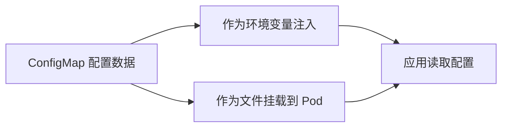

# 配置：使用 ConfigMap 管理配置

一句话：ConfigMap 把配置数据从容器镜像中分离出来，让同一份镜像能适配不同环境。

## 核心要点

* ConfigMap 用来保存非敏感的配置数据
* 配置和镜像分离，同一镜像可用于多个环境
* 可以作为环境变量注入 Pod
* 也可以作为文件挂载到容器的某个路径
* 修改 ConfigMap 后，需要重启 Pod 才能生效（默认情况下）
