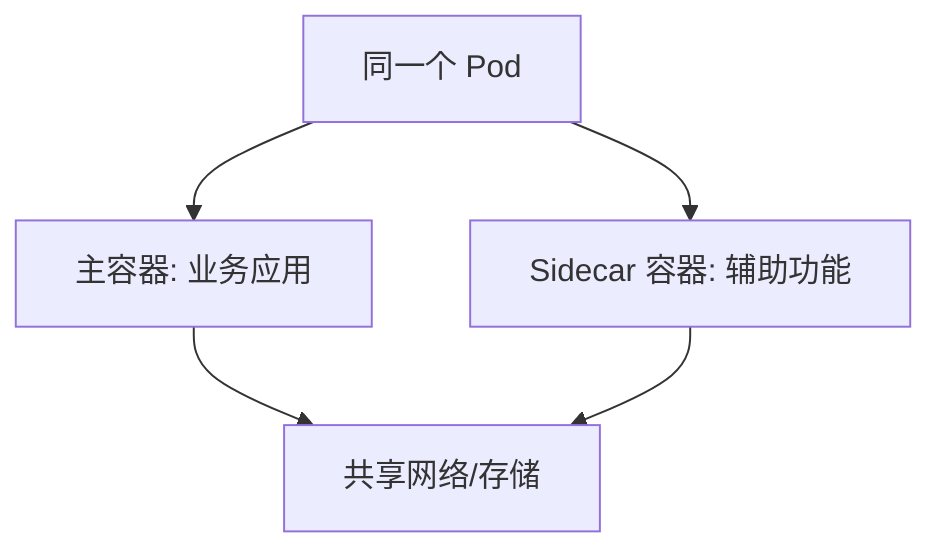

# 构造 Pod：使用 Sidecar 容器

一句话：Sidecar 容器和主容器共享同一个 Pod，专门负责日志收集、代理这类辅助工作。

## 核心要点

* Sidecar 与主容器运行在同一个 Pod 里
* 二者共享网络命名空间和可选的存储卷
* 常见用途：日志收集、监控代理、配置同步
* Kubernetes 支持把 Sidecar 声明为特殊类型的 Init 容器
* 主容器专注业务逻辑，辅助功能交给 Sidecar
