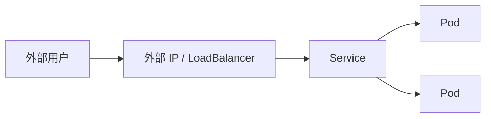

# 无状态应用：公开外部 IP 地址

一句话：无状态应用不保存本地数据，可以随意重建、扩缩，重点是如何让外部用户访问到它。

## 核心要点

* 无状态应用不依赖本地磁盘上的持久数据
* 默认 Service 只能在集群内部访问
* 类型为 LoadBalancer 或 NodePort 的 Service 可暴露外部 IP
* 云环境通常自动分配外部负载均衡器
* 本地环境（如 Minikube）需要额外命令获取可访问地址
