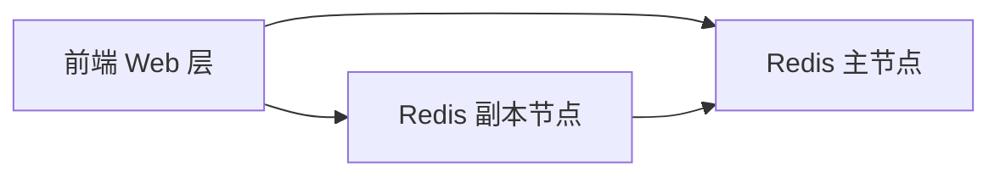

# 实战：使用 Redis 部署留言板应用

一句话：这个经典案例把 Deployment、Service、多层架构综合在一起，展示一个完整的无状态 Web 应用。

## 核心要点

* 前端负责接收留言并读写 Redis
* Redis 采用一主多副本的结构
* 前端、主节点、副本节点各自用独立的 Deployment 管理
* 每一层都配有对应的 Service 方便相互访问
* 这个案例展示了多组件应用的典型拓扑
