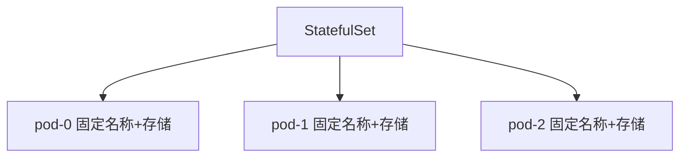

# 有状态应用基础：StatefulSet

一句话：StatefulSet 专门管理需要稳定身份和持久数据的应用，比如数据库集群。

## 核心要点

* StatefulSet 中的 Pod 拥有固定且有序的名称
* 每个 Pod 绑定自己独立的持久卷，重建后数据不丢
* Pod 的创建和删除按顺序进行，而不是并发
* 常用于数据库、消息队列等有状态系统
* 需要配合无头 Service（Headless Service）使用
