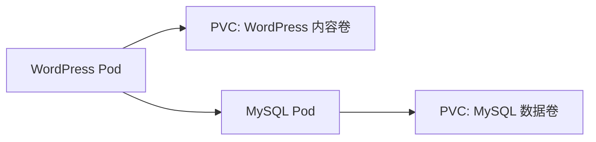

# 实战：使用持久卷部署 WordPress 和 MySQL

一句话：这个案例展示如何用持久卷保证数据库和网站内容在 Pod 重建后依然存在。

## 核心要点

* MySQL 和 WordPress 各自使用独立的 PersistentVolumeClaim
* 数据库密码通过 Secret 传递，不写在明文配置里
* WordPress 通过环境变量得知 MySQL 的连接地址
* 两者都用 Deployment（单副本）配合持久卷管理
* Pod 重建后，内容和数据库数据都不会丢失
