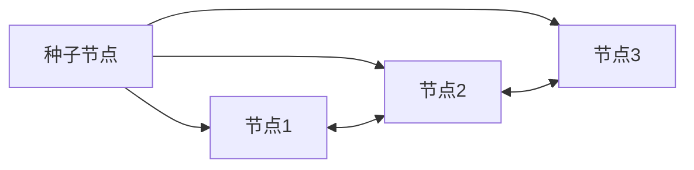

# 实战：使用 StatefulSet 部署 Cassandra

一句话：Cassandra 是天生的分布式数据库，这个案例展示 StatefulSet 如何管理一个真正的集群。

## 核心要点

* Cassandra 节点之间通过种子节点相互发现
* 每个节点通过 StatefulSet 拥有固定名称和独立存储
* 无头 Service 让节点之间可以直接通信
* 扩容只需增加 StatefulSet 的副本数
* 新加入的节点会自动与现有集群同步数据
