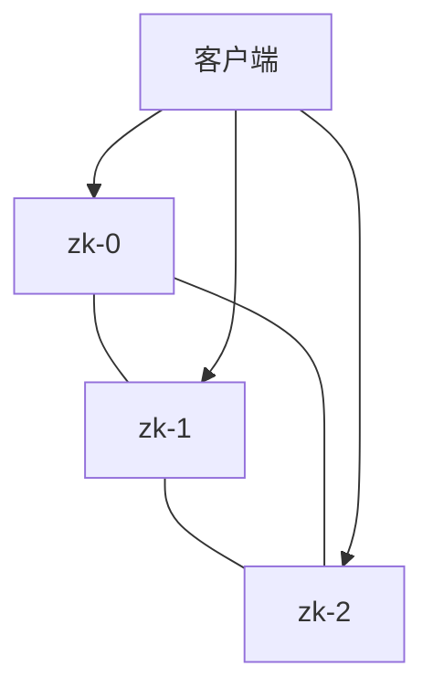

# 实战：运行 ZooKeeper 分布式协调系统

一句话：ZooKeeper 依赖严格的多数派机制保证一致性，这个案例展示如何在 Kubernetes 里稳妥地运行它。

## 核心要点

* ZooKeeper 通常以奇数个节点组成集群（例如 3 或 5）
* StatefulSet 保证节点有固定顺序的名称
* 使用 PodDisruptionBudget 防止同时驱逐太多节点
* 反亲和性规则确保节点分散在不同的物理机上
* 目的是在维护或故障时依然保持多数派可用
