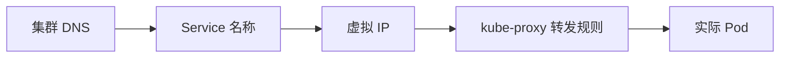

# Service 深入：使用 Service 连接到应用

一句话：这一章把 Service 的原理讲透——它到底是怎么把稳定的名字变成实际流量的。

## 核心要点

* 集群内部可以直接用 Service 名称做 DNS 解析
* Service 拥有一个稳定的虚拟 IP（ClusterIP）
* kube-proxy 在每个节点上维护流量转发规则
* Endpoints/EndpointSlice 记录当前健康的 Pod 列表
* 这套机制让应用之间的连接完全不用关心 Pod 的生命周期
