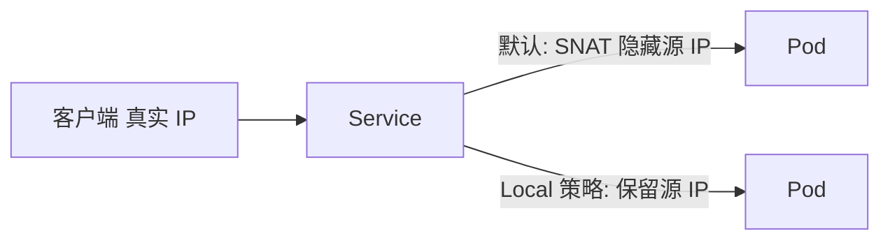

# Service 深入：使用源 IP 与流量保留

一句话：默认情况下 Service 会隐藏客户端真实 IP，某些场景需要专门配置才能保留它。

## 核心要点

* 默认转发策略可能会用节点 IP 替换掉客户端真实 IP
* 应用如果需要做访问控制或统计，往往需要真实源 IP
* `externalTrafficPolicy: Local` 可以保留客户端源 IP
* 使用 Local 策略的代价是流量分发不再跨节点均衡
* 需要根据业务是否关心源 IP 来权衡这个设置
