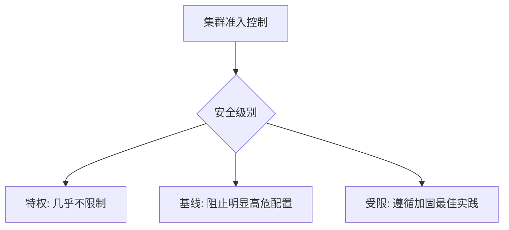

# 安全：在集群级别应用 Pod 安全标准

一句话：Pod 安全标准定义了几档安全基线，集群级别的配置让所有名字空间都默认遵循同一套规则。

## 核心要点

* Pod 安全标准分为 Privileged、Baseline、Restricted 三档
* 集群级别配置作为所有名字空间的默认策略
* 通过准入控制器在 Pod 创建时自动校验
* 不符合标准的 Pod 会被拒绝创建或仅记录警告
* 适合统一给整个集群设定一个安全底线
