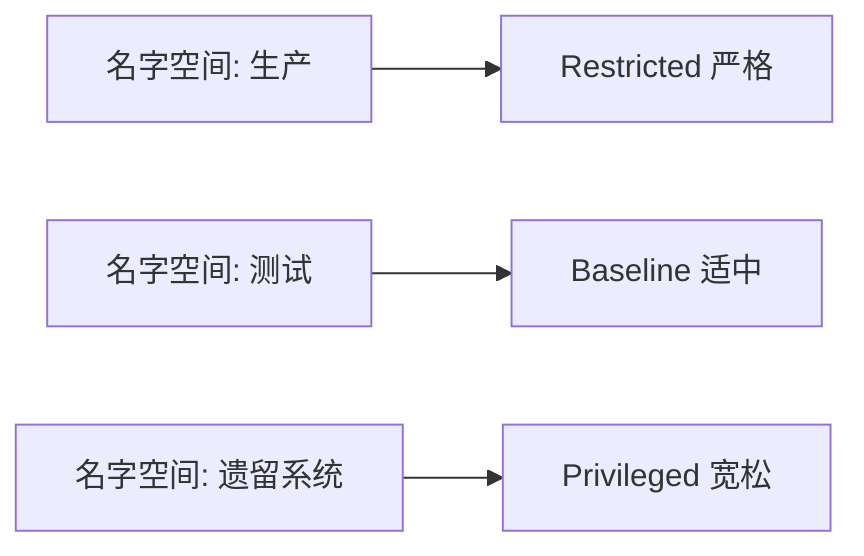

# 安全：在名字空间级别应用 Pod 安全标准

一句话：不同团队、不同业务的安全需求不一样，名字空间级别的配置可以做到更精细的差异化管理。

## 核心要点

* 通过给名字空间打标签来设置安全级别
* 不同名字空间可以使用不同档位的安全标准
* 常见做法：生产用 Restricted，测试用 Baseline
* 遗留系统若暂时无法满足严格标准，可临时放宽
* 名字空间级别的设置会覆盖集群级别的默认值
