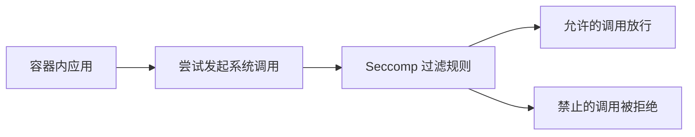

# 安全：使用 Seccomp 限制容器的系统调用

一句话：Seccomp 直接在系统调用这一层设限，进一步缩小容器被攻破后能造成的破坏面。

## 核心要点

* Seccomp 限制容器进程能够使用哪些系统调用
* 大多数应用只需要一小部分系统调用就能正常工作
* Kubernetes 提供内置的 RuntimeDefault 配置文件作为合理起点
* 也可以编写自定义配置文件做更精细的白名单控制
* 与 AppArmor 搭配使用可以形成多层防御
