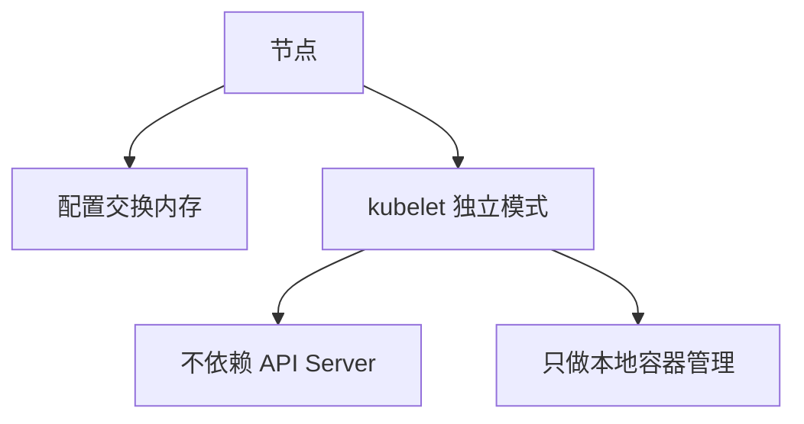

# 集群管理：交换内存与独立模式 kubelet

一句话：这一章讲两个偏底层的集群管理话题——节点上的交换内存配置，以及让 kubelet 脱离控制面单独运行。

## 核心要点

* 交换内存可以在内存紧张时提供额外缓冲
* 启用交换内存需要谨慎评估对性能和调度的影响
* kubelet 独立模式下不连接控制面，不需要 API Server
* 独立模式常用于边缘设备或特殊的本地容器管理场景
* 两者都属于比较进阶的节点级配置
