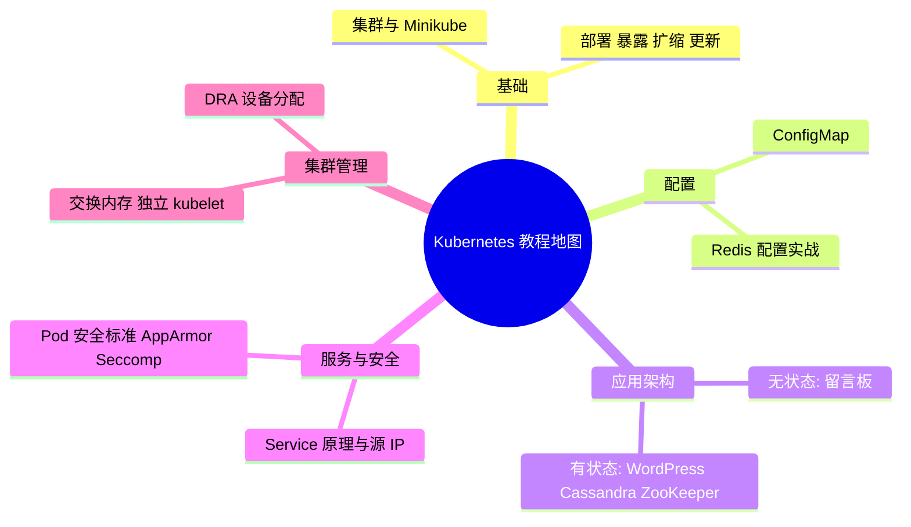

# 总结与学习路径建议

一句话：从概念到实战，这门课程走完了 Kubernetes 官方教程的完整地图，接下来该往哪走由你的场景决定。

## 核心要点

* 基础篇教会你如何创建集群并让应用跑起来
* 配置篇教会你把配置和镜像解耦
* 无状态与有状态应用篇用真实案例巩固架构思维
* 服务与安全篇让你理解流量如何被安全地路由
* 集群管理篇涉及更底层、更进阶的运维话题
* 常见误区：把无状态的做法直接套用在数据库这类有状态系统上
* 下一步：可以深入某个方向，比如可观测性、网络策略，或者调度框架
