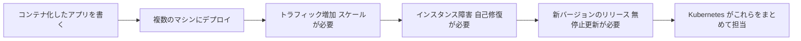

# なぜ Kubernetes を学ぶのか

一言で言うと：アプリケーションが増え複雑になるほど、コンテナを手作業で管理するのはすぐ限界が来る。Kubernetes はそれを自動化する仕組みだ。

## 要点

* Kubernetes はコンテナオーケストレーションシステム
* デプロイ、スケーリング、自己修復、更新を担当する
* このコースは Kubernetes 公式チュートリアルの構成に沿って進める
* 学習順序：基礎 -> 設定 -> ステートレスアプリ -> ステートフルアプリ -> サービス -> セキュリティ -> クラスタ管理
* 各章は公式チュートリアルの実際のシナリオに対応している
