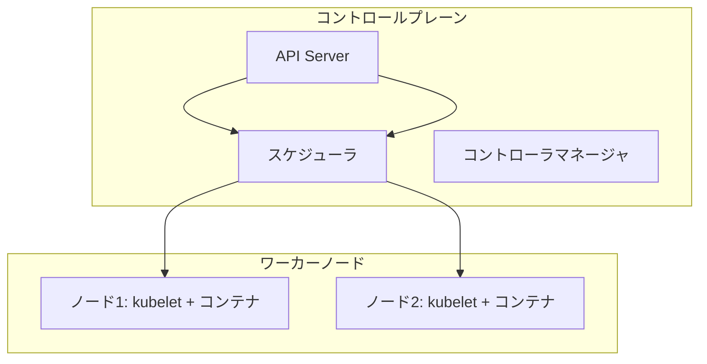

# Kubernetes の基礎：クラスタとコアコンセプト

一言で言うと：Kubernetes クラスタはコントロールプレーンとワーカーノードで構成され、前者が意思決定、後者が実際のコンテナ実行を担当する。

## 要点

* クラスタ = コントロールプレーン + 複数のワーカーノード
* API Server はすべての操作の統一された入り口
* スケジューラは Pod をどのノードで動かすか決定する
* kubelet は各ノードでコンテナを実際に管理するエージェント
* 学習環境では Minikube でローカルに完全なクラスタを再現することが多い
