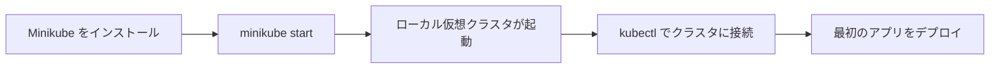

# Hello Minikube：最初のクラスタを作成する

一言で言うと：Minikube を使えば自分のパソコン上でコマンド一つで実際に使えるKubernetesクラスタを起動できる。

## 要点

* `minikube start` コマンド一つでローカルクラスタを起動
* Minikube が自動的に kubectl の接続を設定してくれる
* `kubectl cluster-info` でクラスタが準備できているか確認
* `minikube dashboard` で可視化されたダッシュボードを開ける
* これは以降すべてのチュートリアルの共通の出発点
