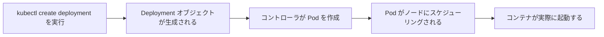

# アプリをデプロイする：kubectl で Deployment を作成する

一言で言うと：Deployment は「何をどれだけ実行したいか」を記述するオブジェクトで、kubectl がその願いを現実にする。

## 要点

* Deployment はアプリの期待される状態を記述する
* `kubectl create deployment` が最も手早い作成方法
* Deployment コントローラは実際の状態を期待する状態に継続的に合わせる
* 一つの Deployment は通常一つのアプリコンポーネントに対応する
* `kubectl get deployments` で現在のすべての Deployment を確認できる
