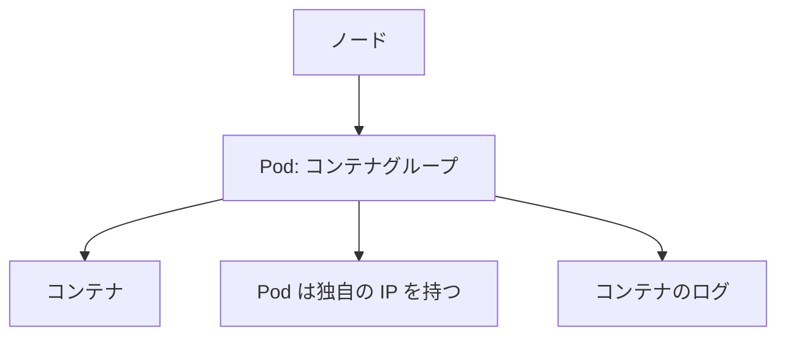

# アプリを理解する：Pod とノードを確認する

一言で言うと：Pod は Kubernetes における最小のデプロイ単位であり、その状態を理解することがあらゆる問題調査の第一歩となる。

## 要点

* Pod はネットワークとストレージを共有する一つ以上のコンテナの集合
* `kubectl get pods` で現在のすべての Pod とその状態を確認
* `kubectl describe pod` である Pod の詳細なイベントを確認
* `kubectl logs` でコンテナが出力するログを確認
* 各 Pod はクラスタ内部で独立した IP を持つ
