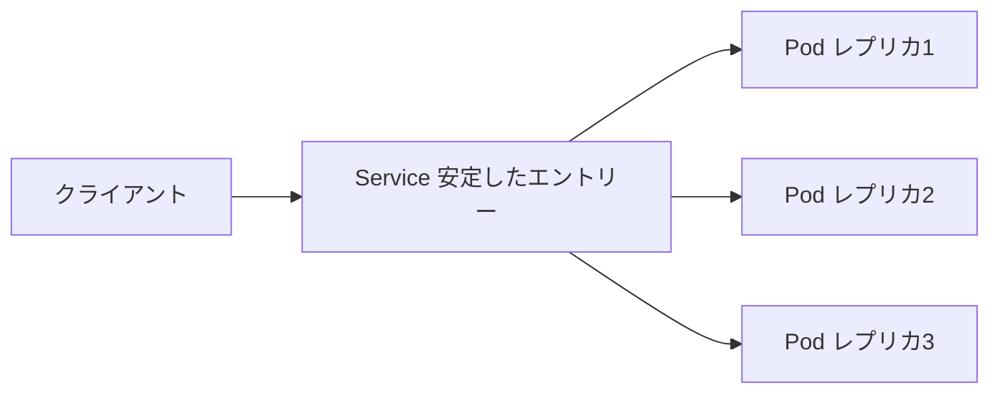

# アプリを公開する：Service を使う

一言で言うと：Pod は再作成され IP も変化するため、Service が安定したエントリーポイントを提供し、他者が常にアプリを見つけられるようにする。

## 要点

* Pod の IP は不安定で、再作成後に変わる
* Service は固定されたアクセスエントリーを提供する
* Service はラベルセレクタで対応する Pod を見つける
* `kubectl expose deployment` で素早く Service を作成できる
* Service は自動的にトラフィックを複数の Pod に分散する
