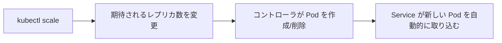

# アプリをスケールする：複数インスタンスを実行する

一言で言うと：トラフィックが増えたとき、必要なレプリカ数を Kubernetes に伝えるだけで、スケジューリングと負荷分散はすべて自動化される。

## 要点

* スケーリングの本質は Deployment の期待レプリカ数を変更すること
* `kubectl scale deployment --replicas=N` が最も直接的な方法
* スケールアップ時、新しい Pod は既存の Service に自動的に取り込まれる
* スケールダウン時、余分な Pod は安全に終了される
* スケーリングにアプリケーションコードの変更は不要
