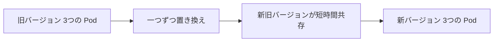

# アプリを更新する：ローリングアップデートを実行する

一言で言うと：ローリングアップデートは旧バージョンの Pod を段階的に新バージョンに置き換え、サービスを中断させない。

## 要点

* `kubectl set image` でローリングアップデートをトリガーする
* 更新中は新旧バージョンの Pod が短時間共存する
* 更新期間中もサービスは利用可能で、一斉にダウンすることはない
* `kubectl rollout status` で更新の進捗を確認する
* `kubectl rollout undo` で前のバージョンにロールバックできる
