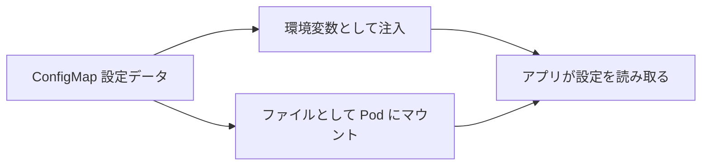

# 設定：ConfigMap で設定を管理する

一言で言うと：ConfigMap は設定データをコンテナイメージから分離し、同じイメージを異なる環境に適応させられるようにする。

## 要点

* ConfigMap は機密でない設定データを保存するために使う
* 設定とイメージを分離することで、同じイメージを複数の環境で使える
* 環境変数として Pod に注入できる
* コンテナ内の特定のパスにファイルとしてマウントすることもできる
* ConfigMap を変更した後、デフォルトでは Pod を再起動しないと反映されない
