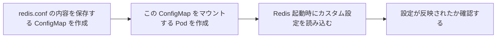

# 実践：ConfigMap で Redis を設定する

一言で言うと：このチュートリアルは ConfigMap を実際のシナリオで使い、Redis の実行パラメータをカスタマイズする方法を示す。

## 要点

* まず redis.conf の内容を含む ConfigMap を作成する
* Pod 定義で ConfigMap をボリュームとしてマウントする
* Redis コンテナ起動時にマウントパス下の設定ファイルを使うよう指定する
* redis-cli で設定パラメータが反映されているか確認できる
* これは ConfigMap の概念から実践までの完全な流れ
